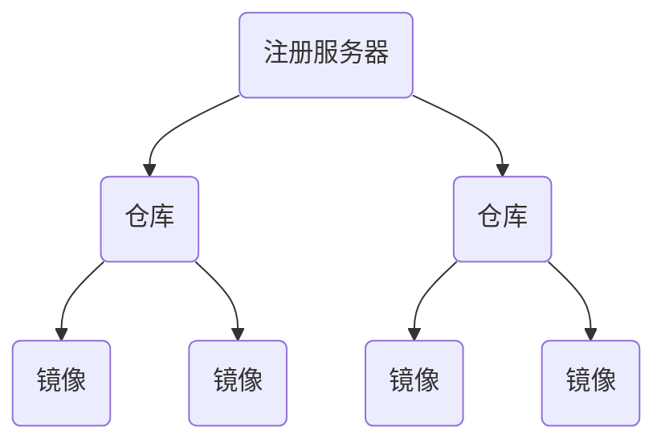

##Docker笔记
[TOC]

### 基础

#### 概念

Docker底层组成：

- `Namespace`：隔离技术的第一层，确保 Docker 容器内的进程看不到也影响不到 Docker 外部的进程。
- `Control Groups`：LXC 技术的关键组件，用于进行运行时的资源限制。
- `UnionFS（文件系统）`：容器的构件块，创建抽象层，从而实现 Docker 的轻量级和运行快速的特性。

Docker的主要构成：

- `Docker Client`：用户和 Docker 守护进程进行通信的接口，也就是 docker 命令。
- `Docker Daemon`：宿主机上用于用户应答用户请求的服务。
- `Registry`：注册服务器，注册服务器是存放仓库（`Repository`）的具体服务器。

Docker的三元素：

- `Images`：只读的 Docker 容器模板，简言之就是系统镜像文件。


- `Container`：用于运行应用程序的容器，包含操作系统、用户文件和元数据，相当于镜像Images的一个运行实例。。
- `DockerFile`：进行镜像创建的指令文件。

##### 镜像

Dockerfile构建镜像，

示例：

```dockerfile
# 基于哪个镜像
FROM debian:jessie

#　镜像创建者
MAINTAINER NGINX Docker Maintainers "docker-maint@nginx.com"

# 设置环境变量
ENV NGINX_VERSION 1.10.1-1~jessie

# 安装软件
RUN apt-key adv --keyserver hkp://pgp.mit.edu:80 --recv-keys 573BFD6B3D8FBC641079A6ABABF5BD827BD9BF62 \
        && echo "deb http://nginx.org/packages/debian/ jessie nginx" >> /etc/apt/sources.list \
        && apt-get update \
        && apt-get install --no-install-recommends --no-install-suggests -y \
                                                ca-certificates \
                                                nginx=${NGINX_VERSION} \
                                                nginx-module-xslt \
                                                nginx-module-geoip \
                                                nginx-module-image-filter \
                                                nginx-module-perl \
                                                nginx-module-njs \
                                                gettext-base \
        && rm -rf /var/lib/apt/lists/*

# forward request and error logs to docker log collector
RUN ln -sf /dev/stdout /var/log/nginx/access.log \
 && ln -sf /dev/stderr /var/log/nginx/error.log

# 内部开启的端口
EXPOSE 80 443

# 容器启动时执行的命令，一个docker里只能有一条cmd命令
CMD ["nginx", "-g", "daemon off;"]
```

> - VOLUME  尅昂本地文件挂载到container中
> - ADD
> - WORKDIR 

然后使用以下命令进行构建：

```shell
docker build -t mnginx_image .
# mnginx_image为镜像名
```


##### 容器

##### 仓库

#### 安装

1. 安装docker

Docker 软件包和依赖包已经包含在默认的 CentOS-Extras 软件源里

```shell
yum -y install docker
# 或者使用脚本安装
curl -fsSL https://get.docker.com/ | sh

# 改进的脚本安装
curl -fsSL get.docker.com -o get-docker.sh
sudo sh get-docker.sh --mirror Aliyun
```

2. 启动docker后台服务

```shell
[root@local122 supervisord.d]# service docker start 
Redirecting to /bin/systemctl start  docker.service
```

3. 运行hello-world

```shell
docker run hello-world
```

> 由于本地没有hello-world这个镜像，所以会下载这个镜像，并在容器内运行

4. 配置镜像加速服务

由于访问原网镜像十分缓慢，因此使用镜像加速服务，[阿里云的镜像加速服务](https://cr.console.aliyun.com/#/accelerator)配置如下：

```shell
vim /etc/docker/daemon.json
{
  "registry-mirrors": ["https://dhn1laum.mirror.aliyuncs.com"]
}
# 然后执行
sudo systemctl daemon-reload
sudo systemctl restart docker
```

### 进阶

命令一览

| 命令                     | 功能                               | 备注                                |
| ---------------------- | :------------------------------- | --------------------------------- |
| docker run name/id     | 运行容器                             | -i -t 实现交互;-d  后台运行，-P端口映射        |
| docker ps              | 查看哪些容器在运行                        | 可以查看端口映射                          |
| docker stop name/id    | 停止容器                             |                                   |
| docker logs name/id    | 查看容器内的标准输出                       | -f，类似tail -f                      |
| docker port name/id    | 查看网络端口映射                         |                                   |
| docker inspect name/id | 使用 docker inspect 来查看Docker的底层信息 | 返回一个 JSON 文件记录着 Docker 容器的配置和状态信息 |
| docker start name/id   | 启动容器                             | 重启使用restart                       |
| docker rm name/id      | 删除容器                             | 删除容器时，容器必须是停止状态                   |
| docker images          | 列出本地主机上的镜像                       |                                   |
|                        |                                  |                                   |

运行容器内容的应用程序

```shell
docker run ubuntu:15.10 /bin/echo "Hello world"
docker pull busybox
```

#### 镜像

##### 搜索和下载镜像

```shell
# 查找官方仓库中的镜像
docker search xxx  

# 下载镜像
# docker pull xx
```

> 基础镜像

##### 推送镜像

```shell
docker push
```

#### 容器

##### 创建容器

```shell
# 创建容器的时候指定名称
docker run -d --name linux123 ubuntu 

# 端口映射
docker run -d --name mng -p9999:80 nginx 
curl localhost:9999

# 执行终端并退出
docker run -it --rm nginx /bin/echo  hello world
docker run nginx /bin/sh -c "while true;do echo helloworld;sleep 1;done" #需要ctrl+c退出

# 执行交互式终端
docker run -it --name linux123 ubuntu /bin/bash
```

##### 进入容器

使用-d参数创建的容器启动后悔进入后台，需要进入容器进行操作的时候，需要使用`docker attach`或者`docker exec`命令

```shell
docker run -itd --name inc nginx 

docker attach inc # 有问题
docker exec -it inc bash
```

##### 删除容器

只能删除处于终止状态的容器，若要删除运行中的容器，需要加-f参数

```shell
docker rm name/id

# 删除所有容器
docker rm $(docker ps -a -q)

# 清理掉所有处于终止状态的容器
docker container prune
```

##### 导入导出

导出

```shell
docker export id > xxx.tar
```

导入

```shell
docker import - test/nginx:v2.0
# 容器快照导入的时候可以重新制定标签等元数据信息
```

> docker load 导入本地镜像文件

#### 仓库 

仓库是集中存放镜像的地方，仓库是一个具体的项目或目录



##### 公共仓库

Docker的官方公共仓库[Docker Hub](https://hub.docker.com/)

##### 私有仓库

```
docker-registry	
```

### 高级

#### 数据管理

##### 数据卷Volumes

数据卷是一个可供一个或多个容器使用的特殊目录：

- 数据卷可在容器之间共享和重用
- 对数据卷的修改立马生效
- 默认一直存在，即是容器被删除

###### 创建数据卷

```shell
docker volume cteate my_vol1

# 查看所有数据卷
docker volume ls

# 查看指定数据卷的信息
docker	volume	inspect	my-vol
```

###### 启动容器的时候挂载数据卷

```shell
docker	run	-d	-P --name web	
				# -v my-vol:/wepapp	
				--mount	source=my-vol,target=/webapp	
				training/webapp	python	app.py
```

###### 删除数据卷

```shell
docker volume rm my_vol1
# 若需要在删除容器的时候同时移除数据卷，则使用docker rm -v命令

# 删除无主的数据卷
docker volume prune
```

##### 监听主机目录

BindMounts

使用--mount	标记可以指定挂载一个本地主机的目录到容器中去。

```shell
docker	run	-d	-P	--name	web	\
			#	-v	/src/webapp:/opt/webapp	\
			--mount	type=bind,source=/src/webapp,target=/opt/webapp	\
			training/webapp	\
			python	app.py
```

上面的命令加载主机的	/src/webapp	目录到容器的	/opt/webapp	目录。这个功能在进行测试的时候十分方便，比如用户可以放置一些程序到本地目录中，来查看容器是否正常工作。本地目录的路径必须是绝对路径，如果目录不存在	Docker	会自动为你创建它。Docker	挂载主机目录的默认权限是读写，用户也可以通过增加readonly指定为	只读。

```shell
docker	run	-d	-P --name	web	\
			#	-v	/src/webapp:/opt/webapp:ro	\
			--mount		type=bind,source=/src/webapp,target=/opt/webapp,readonly	\
			training/webapp	\
			python	app.py
```

加了readonly	之后，就挂载为只读了。如果你在容器内/src/webapp目录新建文件，会显示如下错误

```shell
touch	new.txt
#touch:	new.txt:	Read-only	file	system
```

例子：

```shell
docker run -p 80:80 --name mynginx 
-v $PWD/www:/www 
-v $PWD/conf/nginx.conf:/etc/nginx/nginx.conf 
-v $PWD/logs:/wwwlogs  
-d nginx  
```

> 命令说明：
>
> - **-p 80:80：**将容器的80端口映射到主机的80端口
> - **--name mynginx：**将容器命名为mynginx
> - **-v $PWD/www:/www：**将主机中当前目录下的www挂载到容器的/www
> - **-v $PWD/conf/nginx.conf:/etc/nginx/nginx.conf：**将主机中当前目录下的nginx.conf挂载到容器的/etc/nginx/nginx.conf
> - **-v $PWD/logs:/wwwlogs：**将主机中当前目录下的logs挂载到容器的/wwwlogs

#### 网络配置


 ##参考

- 基础

  [docker基础知识汇总](http://www.imooc.com/article/18030)

  [菜鸟教程docker](http://www.runoob.com/docker/docker-tutorial.html)

  [Docker-从入门到实践](https://github.com/yeasy/docker_practice)

  [docker镜像位置](http://dockone.io/question/70)

