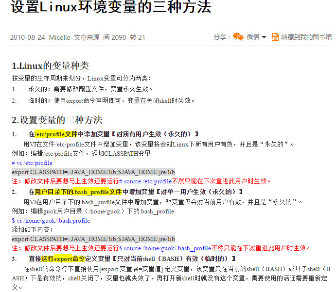

## Linux笔记

### 基础知识

#### 账号权限

##### [用户](https://www.cnblogs.com/xd502djj/archive/2011/11/23/2260094.html)

显示用户

```mysql
# 显示所有用户
awk -F":" '{print $1}' /etc/passwd 
```

添加用户

```shell
# -M添加用户ftpuser,-d指定目录为/opt/ftp,-g所属组为ftpgroup
useradd -g ftpgroup -d /opt/ftp -M ftpuser

# 可以直接使用-m选项为用户创建相应的账号和用户目录/home/username

# 修改ftpuser的密码
passwd ftpuser   
```

> 默认情况下，添加用户的操作会相应的增加一个同名的组，

删除用户

```shell
userdel -r username
#带-r删除用户的同时，删除其目录
```

其它

```shell
#修改root密码
登录root账号，sudo passwd root或者之间passwd，重复输入两次密码即可
```

##### 组

添加组

```shell
groupadd test   
```

查看组

```shell
#查看当前用户所属组
groups

# 查看系统所有组
cat /etc/group
```

> [/etc/group详解](/etc/group详解)
>
> 组名:口令:组标识号:组内用户列表(逗号隔开)

添加用户到组

```
usermod -G groupname username
```

> 一个用户可以属于多个组，此命令将用户添加到新组中，不改变其原先的组

变更用户组

```shell
usermod -g groupname username
```

> 将用户添加到新组中，并从原有的组中除去

##### 权限

查看权限

```
使用ls -l可查看文件的属性字段，文件属性字段总共有10个字母组成，第一个字母表示文件类型，如果这个字母是一个减号”-”,则说明该文件是一个普通文件。字母”d”表示该文件是一个目录， 后面的9个字母为该文件的权限标识，3个为一组，分别表示文件所属用户、用户所在组、其它用户的读写和执行权限
```

更改权限

```shell
chown userMark(+|-)PermissionsMark
```

> userMark取值：
>
> - u：用户
> - g：组
> - o：其它用户
> - a：所有用户
>
> PermissionsMark取值：
>
> - r:读
> - w：写
> - x：执行

更改所有者

```shell
chown username:groupname dirOrFile

#使用-R选项递归该目录下所有文件的拥有者
chown -R username:groupname dir
```

更改所属组

```shell
chgrp -v -R dirOrFile
```

#### 文件目录

参考[Linux文件系统详解](https://mp.weixin.qq.com/s/yuyRNlNQQQs6BHJKtQJOQg)

##### 文件

###### 文件信息

文件的时间

```shell
###各类时间说明
#1、访问时间，读一次这个文件的内容，这个时间就会更新。比如对这个文件使用more命令。ls、stat命令都不会修改文件的访问时间。
#2、修改时间，对文件内容修改一次，这个时间就会更新。比如：vi后保存文件。ls -l列出的时间就是这个时间。
#3、状态改变时间。通过chmod命令更改一次文件属性，这个时间就会更新。查看文件的详细的状态、准确的修改时间等，可以通过stat命令 文件名。
```

获取文件的（修改）时间，并比较文件的新旧

```shell
src=$1
dst=$2

src_mt=`stat $src |grep ^Modify | awk '{split($3,arr,".");print $2,arr[1]}'`
dst_mt=`stat $dst |grep ^Modify | awk '{split($3,arr,".");print $2,arr[1]}'`

src_mts=`date -d"$src_mt" +%s`
dst_mts=`date -d"$dst_mt" +%s`

if [ $src_mts -gt $dst_mts ];then
{
	echo "[$src][$src_mt] > [$dst][$dst_mt]"
	rsync.exe  -avP $src $dst
}
elif [ $src_mts -lt $dst_mts ];then
{
	echo "[$dst][$dst_mt] > [$src][$src_mt]"
	rsync.exe  -avP $dst $src
}
else
{
	echo "[$dst][$dst_mt] = [$src][$src_mt]"
}
fi
```

###### 文件内容

查看文件内容

```shell
less/more/head/tail xxx

head -n20 xxx
tail -n20 xxx
tail -f xxxx
```

读取文件内容

```shell
# 将xxx.txt文件的内容读取到a,b两个变量中取(以空格分割，例如1 2 3 4 会被赋值为a="1" b="2 3 4" )
while read a b;do
	# do something
done < xxx.txt

for line in $(cat xxx.txt);do
	echo "$line"
done
```

文件内容进度显示加判断

```shell
#lianmeng_mobile2.data 内容格式为 xxx|xxx|xxx
function proces()
{
    total=0;cur=1;
    echo -n > total_mobile.data
    while read line;do
        os=$(echo $line|awk -F'|' '{print $1}')  # 字段抽取（shell字段分割不强大）
        ua=$(echo $line|awk -F'|' '{print $2}')
        num=$(echo $line|awk -F'|' '{print $3}')
        #ua=${line%%|*}
        #num=${line##*|}
        #echo "$os"
        #echo "$ua"
        #echo "$num"
        cur=$((cur+1))
        total=$((total+num))

        if [ $((cur%30)) == 0 ];then   # 每30行处理一下
            sleep 2
            echo "===========kill process=========="
            ps -ef|grep detector |awk '{print "kill -9 " $2}'|sh
        fi

        if [ $num -gt 100 ];then   # 条件判断
            browser=$(detector "\'${ua}\'" | grep -oP '(?<=Browser: ).*(?=@)')
            echo -e "${cur}/293115:${os}|${ua}|${browser}|${num}"
            echo -e "${os}|${ua}|${browser}|${num}" >> total_mobile.data
        fi
    done< lianmeng_mobile2.data

    echo "total:$total" >> total_mobile.data
}
```

###### 重命名

文件批量重命名

```shell
for d in 201603??;do echo ${d}; cd ${d}; rename -n 's/\*\.log\.gz//' *.log.gz ; cd ..;done
```

> 参考[rename](http://man.linuxde.net/rename)命令，此外注意rename支持和sed一样的语法：
>
> ```shell
> 三个参数：
> - 原字符串：将文件名需要替换的字符串；
> - 目标字符串：将文件名中含有的原字符替换成目标字符串；
> - 文件：指定要改变文件名的文件列表。
> ```

##### 目录

###### [系统目录](https://mp.weixin.qq.com/s/yuyRNlNQQQs6BHJKtQJOQg)


###### 创建和修改

一次性创建多级目录

```shell
mkdir -p ./application/{controllers,models,static,static/css,static/js,templates}
```

批量修改目录

```shell

```

###### 跳转

linux的目录快捷跳转可以通过以下两种方式：

别名

```shell
alias mgb='cd xxx & ls -lh'
alias c1='cd ../ && ll'
alias c2='cd ../../ && ll'
```

软件-[autojump](https://blog.csdn.net/caojinlei_91/article/details/80502753)

```shell
# 手动安装
git clone git://github.com/wting/autojump.git
cd autojump
./install.py or ./uninstall.py
```

软件-[z.sh](https://blog.csdn.net/molaifeng/article/details/14123123)

```shell
z.sh只是一个sh文件，放在开机启动中执行即可使用
```

参考：

[autojump的github官网](https://github.com/wting/autojump)

[z.sh的github官网](https://github.com/rupa/z/blob/master/z.sh)

###### 获取目录

获取当前运行文件所在的目录

```shell
# 当前目录完整路径
dir=`dirname $0` && dir=`cd $dir && pwd`

# 当前目录(父目录)
fpath=$(echo $dir|awk -F'/' '{print $(NF-1);}')
```

全局函数获取参数文件的目录

```shell
function gd()
{
    local fname=$1
    ffname=$(readlink -f $fname)
    echo $ffname
}
```

显示目录结构

```shell
# tree命令
tree -L 1 /
```

##### 管道

###### 未命名管道

会话结束则管道释放

```shell
echo "xxx"|grep 
```

###### 命名管道

[命名管道的应用](https://www.cnblogs.com/xupeiyuan/p/shell_pipe_base.html)

```shell

```

##### 权限

###### 文件

文件的最高权限是666，umask的默认是0022，第一位0是特殊权限，022是默认权限，

最高权限-默认权限=文件的真实权限`_rw_r__r__`

###### 文件夹

文件夹的最高权限是777，umask的默认是0033，第一位0是特殊权限，033是默认权限

最高权限-默认权限=文件的真实权限`_rw_r__r__`

[umask更改](https://www.cnblogs.com/wish123/p/7073114.html)

```shell
umask 0022
```

##### 归档压缩

###### 归档

数据归档

```shell

```

###### 解压缩

**压缩和解压**

zip 命令（zip格式）

```shell
压缩：
    压缩文件：zip 压缩文件名 源文件
    压缩目录： zip -r 压缩文件名 源目录

解压缩
	unzip 压缩文件名（不区分文件和目录）
```

gzip命令（gz格式）

```shell
压缩
    压缩文件：
        gzip 源文件 # 压缩为.gz格式的压缩文件，源文件会消失
        gzip -c 源文件>压缩文件.gz #可以保留源文件
    压缩目录： 不支持，但可以用gzip -r 来递归压缩文件夹内的每个文件（这个指的是每个文件都会被压缩）

解压缩
    解压文件：gzip -d 压缩文件或者gunzip 压缩文件，压缩包会消失
    解压目录：gzip -d -r 压缩文件或者gunzip -r 压缩文件 压缩包会消失
```

bzip2命令（bz2格式）

```shell
压缩
    压缩文件：
        bz2 源文件 	 # 压缩为bz2格式的文件，不保留源文件
        bzip2 -k 源文件 # 压缩之后保留源文件
    压缩目录： 根本不支持
解压缩
    bzip2 -d 压缩文件 # 压缩文件会消失，-k保留压缩文件
    bunzip2 压缩文件  # -k保留压缩文件
```

tar命令和格式.tar.gz和.tar.bz2

```shell
压缩	
    压缩文件和目录（不作区分） 
        1）打包：tar -cvf 打包文件名 源文件  # tar -cvf jaw.tar  jaw
        2）压缩：zip jaw.tar.zip jaw.tar
    其便捷方式是：
    tar -zcvf 压缩文件名.tar.gz  源文件1 源文件2  #-z 压缩格式为.tar.gz格式
    tar -jcvf 压缩文件名.tar.bz2 源文件1 源文件2  #-j 压缩格式为.tar.bz2格式
    注意压缩文件名用绝对路劲指定压缩文件存放的目录

解压缩
    解压文件和目录（不作区分）
        1）解压缩 gzip -d
        2）解包： tar -xvf 打包文件名
    其便捷方式是：
    tar -zxvf 压缩文件名.tar.gz  
    tar -jxvf 压缩文件名.tar.bz2 -C "destdir"  
    注意用"-C"选择指定解压到的目录

    补充：
    只查看 tar -ztvf xx.tar.gz 只查看
```

**压缩文件的内容**

查看压缩文件的内容

```shell
zcat xxx.tar.gz
```

搜索内容

```shell
zgrep --binary-files=text 'ssss' xxx.tar.gz # 或者
zcat xxx.tar.gz |grep --binary-files=text 'ssss'
```

#### 软件安装

软件安装有三种方式：

- 包安装
- 源码编译安装
- 直接解压配置环境

##### 包管理

###### rpm

安装

```shell
rpm -ivh
rpm -qa
```

查看

```shell
rpm -ql 包名
```

卸载

```shell
# 卸载rpm包
首先通过  rpm -q <关键字> 可以查询到rpm包的名字
然后 调用 rpm -e <包的名字> 删除特定rpm包
如果遇到依赖，无法删除，使用 rpm -e --nodeps <包的名字> 不检查依赖，直接删除rpm包
如果恰好有多个包叫同样的名字，使用 rpm -e --allmatches --nodeps <包的名字> 删除所有相同名字的包， 并忽略依赖
```

依赖

```
根据缺少的库名，查对应的包名,网址：https://pkgs.org/
```

###### yum

yum源的本质是什么？

**编辑配置**

yum的配置一般有两种方式，一种是直接配置/etc/yum.conf文件，另外一种是在/etc/yum.repos.d目录下增加.repo文件。 

yum配置`/etc/yum.conf`

```shell
cat /etc/yum.conf

[main]
cachedir=/var/cache/yum          #yum下载的RPM包的缓存目录
keepcache=0             		#缓存是否保存，1保存，0不保存。
debuglevel=2                     #调试级别(0-10)，默认为2(具体调试级别的应用，我也不了解)。
logfile=/var/log/yum.log         #yum的日志文件所在的位置
exactarch=1          #在更新的时候，是否允许更新不同版本的RPM包，比如是否在i386上更新i686的RPM包。
obsoletes=1          #这是一个update的参数,简单的说就是相当于upgrade，允许更新陈旧的RPM包。
gpgcheck=1           #是否检查GPG(GNU Private Guard)，一种密钥方式签名。
plugins=1            #是否允许使用插件，默认是0不允许，但是我们一般会用yum-fastestmirror这个插件。
installonly_limit=3  #允许保留多少个内核包。
exclude=selinux*     #屏蔽不想更新的RPM包，可用通配符，多个RPM包之间使用空格分离。
# PUT YOUR REPOS HERE or IN separate files named file.repo
# in /etc/yum.repos.d
```

yum源编辑`/etc/yum.repos.d/`

```shell
/etc/yum.repos.d
[root@local122 yum.repos.d]# ls -lh
total 32K
-rw-r--r--. 1 root root  166 Nov 24  2016 docker.repo
-rw-r--r--. 1 root root 1.3K May 19  2015 fedora.repo
-rw-r--r--. 1 root root 1.3K May 19  2015 fedora-updates.repo
-rw-r--r--. 1 root root 1.3K May 19  2015 fedora-updates-testing.repo
-rw-r--r--. 1 root root 2.5K Sep 22  2014 percona-release.repo
-rw-r--r--. 1 root root  241 Sep 30  2015 virtualbox.repo
```

> yum仓库分为 网络yum源（http、ftp等）和本地yum源（file://)

**命令**

```shell
yum repolist enabled  # 查看所有已安装的yum源
yum repolist          # 列出所有可用的yum仓库
yum clean all         # 清理yum缓存
yum makecache         # 缓存yum仓库

yum check-update	#表示检查更新
yum update		    #表示升级
yum search			#表示搜索软件包
yum list			#表示列出可用软件包
yum remove			#表示卸载
yum clean			#表示清除yum缓存目录内容
选项-y表示在所有需要交互式确认的地方默认输入yes
```

参考：

[yum配置与使用(推荐)](https://www.cnblogs.com/xiaochaohuashengmi/archive/2011/10/09/2203916.html)

###### apt

apt和apt-get命令之间的区别

虽然 apt 与 apt-get 有一些类似的命令选项，但它并不能完全向下兼容 apt-get 命令。也就是说，可以用 apt 替换部分 apt-get 系列命令，但不是全部。

| apt 命令           | 取代的命令                | 命令的功能           |
| ---------------- | -------------------- | --------------- |
| apt install      | apt-get install      | 安装软件包           |
| apt remove       | apt-get remove       | 移除软件包           |
| apt purge        | apt-get purge        | 移除软件包及配置文件      |
| apt update       | apt-get update       | 刷新存储库索引         |
| apt upgrade      | apt-get upgrade      | 升级所有可升级的软件包     |
| apt autoremove   | apt-get autoremove   | 自动删除不需要的包       |
| apt full-upgrade | apt-get dist-upgrade | 在升级软件包时自动处理依赖关系 |
| apt search       | apt-cache search     | 搜索应用程序          |
| apt show         | apt-cache show       | 显示安装细节          |

当然，apt 还有一些自己的命令：

| 新的apt命令          | 命令的功能              |
| ---------------- | ------------------ |
| apt list         | 列出包含条件的包（已安装，可升级等） |
| apt edit-sources | 编辑源列表              |

##### 源码编译

###### make

遵循configure->make->make install三部曲

```shell
./configure --prefix=/usr/local/xxx
make
make test & make install
```

###### cmake

make和cmake的区别在哪？cmake依赖的CMakeList.txt的关系

```shell

```

#### 服务管理

##### 查看服务

[查看系统安装了哪些服务](https://www.toutiao.com/i6605661302079619587/)的6种方式

```
service --status-all
chkconfig --list
ps aux
进入init.d目录查看
netstat -lntp
ntsysv
```

##### 系统启动

[启动过程](https://www.toutiao.com/i6582013297011196430/)：


> 运行级别：

```shell
运行级别0：系统停机状态，系统默认运行级别不能设为0，否则不能正常启动
运行级别1：单用户工作状态，root权限，用于系统维护，禁止远程登陆
运行级别2：多用户状态(没有NFS)
运行级别3：完全的多用户状态(有NFS)，登陆后进入控制台命令行模式
运行级别4：系统未使用，保留
运行级别5：X11控制台，登陆后进入图形GUI模式
运行级别6：系统正常关闭并重启，默认运行级别不能设为6，否则不能正常启动
```

参考：[linux系统的7种运行级别](http://blog.chinaunix.net/uid-22746363-id-383989.html) 

###### 开机启动

`chkconfig`和`systemctl enable`

以mysql为例:

```shell
# step1:将服务文件拷贝到init.d下，并重命名为mysql
cp /usr/local/mysql/support-files/mysql.server /etc/init.d/mysql   

# step2:赋予可执行权限
chmod +x /etc/init.d/mysql    

# step3:添加服务
chkconfig --add mysql        

# step4:显示服务列表
chkconfig --list 
# 如果看到345都是on的话，则成功，否则执行
chkconfig --level 345 mysql on
```

快捷命令：`systemctl enable mysqld.service`

##### 定时任务

###### crontab

crontab其实是文件，目录地址是/var/spool/cron/，该文件夹下存在着所有用户的crontab文件，每个用户的crontab都是在其以其用户名命名的文件。 

在计算机正常的情况下，才执行，参数列表如下:

```shell
-u user：用来设定某个用户的crontab服务，例如，“-u ixdba”表示设定ixdba用户的crontab服务，此参数一般有root用户来运行。

file：file是命令文件的名字,表示将file做为crontab的任务列表文件并载入crontab。如果在命令行中没有指定这个文件，crontab命令将接受标准输入（键盘）上键入的命令，并将它们载入crontab。

-e：编辑某个用户的crontab文件内容。如果不指定用户，则表示编辑当前用户的crontab文件。

-l：显示某个用户的crontab文件内容，如果不指定用户，则表示显示当前用户的crontab文件内容。

-r：从/var/spool/cron目录中删除某个用户的crontab文件，如果不指定用户，则默认删除当前用户的crontab文件。

-i：在删除用户的crontab文件时给确认提示。
```

在crontab中使用命令和变量牵涉到%的时候要用“\”转义

```shell
00 01 * * * mysqldump -u root --password=passwd-d mustang > /tmp/mustang_$(date +\%Y\%m\%d_\%H\%M\%S).sql
```

crontab最小单位是分，可通过变化操作实现到半分钟的控制粒度

参考：[Linux crontab定时任务管理](http://www.imooc.com/video/10979)，[开源crontab管理系统](https://gitee.com/terrytan/opencron/#%E8%BF%90%E8%A1%8C%E7%8E%AF%E5%A2%83)

###### anacron

处理服务器开关机问题,在该执行的时候因为故障没有执行，在服务器正常的时候，重新执行

```

```

##### 应用服务

应用服务器的配置，centos6采用的是service service action的方式，而centos7采用的是systemctl action servicename

###### service命令

```shell
service nginx start
service nginx restart
service nginx stop
service nginx reload
```

###### **[systemctl命令](http://man.linuxde.net/systemctl)**

systemctl命令是系统服务管理器指令，它实际上将 [service](http://man.linuxde.net/service) 和 [chkconfig](http://man.linuxde.net/chkconfig) 这两个命令组合到一起。

| 任务         | 旧指令                                      | 新指令                                      |
| ---------- | ---------------------------------------- | ---------------------------------------- |
| 使某服务自动启动   | chkconfig --level 3 [httpd](http://man.linuxde.net/httpd) on | systemctl [enable](http://man.linuxde.net/enable) httpd.service |
| 使某服务不自动启动  | chkconfig --level 3 httpd off            | systemctl disable httpd.service          |
| 检查服务状态     | service httpd status                     | systemctl status httpd.service （服务详细信息） systemctl is-active httpd.service （仅显示是否 Active) |
| 显示所有已启动的服务 | chkconfig --list                         | systemctl list-units --[type](http://man.linuxde.net/type)=service |
| 启动某服务      | service httpd start                      | systemctl start httpd.service            |
| 停止某服务      | service httpd stop                       | systemctl stop httpd.service             |
| 重启某服务      | service httpd restart                    | systemctl restart httpd.service          |

参考：[centos6和centos7的区别](https://www.toutiao.com/i6602411750178423309/)

#### 进程管理

进程是操作系统的概念，每次执行一个程序就相当于创建了一个进程，伴随着资源的分配和释放，可以认为进程是一个程序的执行过程

##### 查询进程

ps

```shell
# 查询所有进程
ps -ef
ps -ajx  # 以完整的格式显示所有进程

# 查询某个用户的进程
ps -ef|grep username
ps -lu username

# 查询进程名中包含re的进程
pgrep re

# 查找僵尸进程
ps -A -o stat,ppid,pid,cmd | grep -e '^[Zz]'
```

[lsof](http://man.linuxde.net/lsof)

```shell
# 查看端口占用的进程
lsof -i:3306

# 查看文件占用的进程
lsof abc.txt # 显示开打开文件abc.txt的进程

# 查看指定的用户(进程)打开的文件
lsof -u username

# 查看指定的进程号打开的文件
lsof -p pid
lsof -c pname

# 查看指定目录下本进程打开的文件(使用+D递归目录)
lsof +d dir1/
lsof +D dir1/ 同上，但是会搜索目录下的目录，时间较长
```

##### 杀死进程

```shell
kill pid

# 杀死相关进程
kill -9 pid

# 批量杀死进程
pkill -9 pname
```

批量杀死进程

```shell
ps -ef |grep mysql2hdfs |awk '{print $2}' |xargs kill -9
# 或者
ps -ef |grep mysql2hdfs |awk '{print "kill -9 " $2}'|sh
# 或者
pgrep mysql2hdfs |awk '{print $2}' |xargs kill -9
# 或者
pkill -9 mysql2hdfs
```

> 详细参考：[使用awk批量杀死进程](http://blog.csdn.net/hi_kevin/article/details/17024107),其功能等效于pkill 进程名称

##### 进程监控

###### top/htop

top监视的是整个机器所有用户的资源消耗情况，还是用户自己的？

参数解释：

- PID：进程的ID
- USER：进程所有者
- PR：进程的优先级别，越小越优先被执行
- NI：nice值
- VIRT：进程占用的虚拟内存
- RES：进程占用的物理内存
- SHR：进程使用的共享内存
- S：进程的状态, S-休眠，R-正在运行，Z-僵死状态，N-该进程优先值为负数
- %CPU：进程占用CPU的使用率
- %MEM：进程使用的物理内存和总内存的百分比
- TIME+：该进程启动后占用的总的CPU时间，即占用CPU使用时间的累加值。
- COMMAND：进程启动命令名称

监控目标：

```shell
#查看占用cpu最高的进程（或者top （然后按下M，注意这里是大写））
ps aux|head -1;ps aux|grep -v PID|sort -rn -k +3|head

#查看占用内存最高的进程（或者top （然后按下P，注意这里是大写））
ps aux|head -1;ps aux|grep -v PID|sort -rn -k +4|head
```

###### [supervisor](https://segmentfault.com/a/1190000009724730)

supervisor是强大的进程监控和管理工具

```shell
yum install supervisor
```

#### 网络管理

##### 命令

###### telnet

测试远程端口是否打开

```shell
telent ip port
```

###### netstat

```shell

```

###### [ss](https://segmentfault.com/a/1190000007946958)

```

```

###### [nc](https://www.toutiao.com/i6561586650239992334/)

```shell

```

###### nmap

```shell

```

###### [ngrep](http://man.linuxde.net/ngrep)

ngrep命令是grep命令的网络版，他力求更多的grep特征，用于搜寻指定的数据包。正由于安装ngrep需用到libpcap库， 所以支持大量的操作系统和网络协议。能识别TCP、UDP和ICMP包，理解bpf的过滤机制。

```shell

```

##### 实战

###### 查询网络服务和端口

```shell
# 列出所有端口
netstat -a

# 列出所有tcp端口
netstat -at

# 列出所有监听的服务状态
netstat -l
```

查询xx端口现在运行什么程序

```shell
#第一步，查询使用该端口的进程的PID；
lsof -i:7902
# 第二步,查询该进程
ps -ef|grep pid
```

###### 网络路由

```shell
# 查看路由状态
route -n

# 探测前往地址IP的路由路径
traceroute IP

# dns查询，寻找域名domain对应的IP
host www.baidu.com
#或者ping查询，查找域名对应的ip

# 反向dns查询
host ip
```

#### 性能监控

##### 监控命令

###### **top**

```shell
yum install htop
htop
```

平均负载分别表明从左到右1分钟、5分钟、15分钟内，单位时间内处于等待状态的任务数；（等待 的意思 表明在等待cpu、或者等待IO）,负载主要体现在CPU负载和IO负载,排查具体的负载原因的方式如下

###### [**sar**](https://www.cnblogs.com/howhy/p/6396437.html)

  sar（System ActivityReporter系统活动情况报告）是目前Linux上最为全面的系统性能分析工具之一，可以从多方面对系统的活动进行报告，包括：文件的读写情况、系统调用的使用情况、磁盘I/O、CPU效率、内存使用状况、进程活动及IPC有关的活动等 

```shell
07:00:01 PM     CPU     %user     %nice   %system   %iowait    %steal     %idle
07:10:01 PM     all      0.17      0.00      0.12      0.00      0.00     99.71
07:20:01 PM     all      0.17      0.00      0.11      0.00      0.00     99.72
```

> %user 用户空间的CPU使用
>
> %nice 改变过优先级的进程的CPU使用率
>
> %system 内核空间的CPU使用率
>
> %iowait CPU等待IO的百分比 
>
> %steal 虚拟机的虚拟机CPU使用的CPU
>
> %idle 空闲的CPU

iowait过高表示存在I/O瓶颈，

##### 排查流程

1.查看平均负载（top/uptime命令）

2.确认CPU、IO有无瓶颈；（使用 sar vmstat）

3.CPU负载过高时寻找流程：

4.IO负载过高时寻找流程；

**CPU负载过高排查**

```
使用top/sar确认目标，然后通过ps查看进程状态和cpu使用时间，最后使用strace和oprofile进一步查看
```

**IO负载过高排查**

```

```


#### 其它

##### 系统信息

主机名

```shell
# centos6
/etc/sysconfig/network
# centos7
/etc/hostname
```

##### 防火墙

centos6采用的是iptables，centos7采用的是firewalld

###### iptables

命令

```shell
# 查看iptables状态
service iptables status

# 开启/关闭/重启
service iptables start/stop/restart
```

配置文件

```shell
vim /etc/sysconfig/iptables-config
vim /etc/sysconfig/iptables
```

参考：[一张图掌握基本的iptables操作](https://www.toutiao.com/i6581300820061454855/)

###### firewalld 

```shell

```

##### 命令积累

参考：[Linux命令速查表](https://blog.csdn.net/waitig1992/article/details/51884653)

###### 随机数

[shuf命令](https://mp.weixin.qq.com/s/frlombQOFGhLRfAReq5Fpw)

```shell
#随机生成和随机抽选文件的内容
shuf xxx.txt
shuf -n2 xxx.txt

# -e 标志传入输入，而不是从文件中读取行
shuf -e 1 2 3 4 5
shuf -n2 -e 1 2 4
shuf -e `seq 1 2 5`

# 随机生成指定范围内的数字
shuf -n2 -i 1-10
```

###### 其它

sleep

```shell
sleep 1    # 睡眠1秒
sleep 1s   # 睡眠1秒
sleep 1m   # 睡眠1分
sleep 1h   # 睡眠1小时
```

##### 内核升级

此处的升级方法仅限于centos派的yum/rpm,64bit。另外可参考自[编译内核](https://blog.janfou.com/technical-documents/10485.html)

安装

```shell
# 查看当前内核
uname -r

# step1:导入key
rpm --import https://www.elrepo.org/RPM-GPG-KEY-elrepo.org

# step2:升级至当前最稳定内核
yum install -y http://www.elrepo.org/elrepo-release-7.0-3.el7.elrepo.noarch.rpm  #添加源
yum --enablerepo=elrepo-kernel install -y kernel-ml  #安装当前最新内核，以后升级内核直接运行这句就可

# step3：升级指定内核
# 到这个网址选择内核版本http://elrepo.reloumirrors.net/kernel/el7/x86_64/RPMS/，然后使用
yum install -y  http://elrepo.reloumirrors.net/kernel/el7/x86_64/RPMS/kernel-lt-4.4.101-1.el7.elrepo.x86_64.rpm

# 补充：在centos6上使用以下的命令成功升级内核
yum install -y  http://elrepo.reloumirrors.net/kernel/el6/x86_64/RPMS/kernel-lt-4.4.101-1.el6.elrepo.x86_64.rpm
```

> 另一种方法是：
>
> ```shell
> yum -y install kernel
> 然后使用reboot重启系统
> ```

配置

```shell
vim /etc/grub.conf
# 修改Grub引导顺序,般新安装的内核在第一个位置，所以设置default=0，表示启动新内核

 grub2-mkconfig -o /boot/grub2/grub.cfg   # 重新编译内核启动文件，以后升级完内核也要执行一次
```

删除旧内核

```shell
rpm -qa | grep kernel
yum autoremove kernel-3.10.0-327.13.1.el7.x86_64
```

参考：

[Centos升级系统内核](http://blog.csdn.net/reyleon/article/details/52229293)

[Centos/Linux升级系统内核](http://www.linuxidc.com/Linux/2015-02/112961.htm)

### 技能积累

#### 日期时间

##### date

```shell
# 获得当前时间戳
date +%s 可以得到UNIX的时间戳;

#时间字符串转时间戳：
date -d "2010-10-18 00:00:00" +%s 输出形如：1287331200

#时间戳转换为字符串：
date -d @1287331200 "+%Y-%m-%d" 输出形如：2010-10-18
```

#### 网络传输

Apache开源四大镜像站点：

[**http://mirror.bit.edu.cn/apache/**](http://mirror.bit.edu.cn/apache/)   

[**http://mirrors.hust.edu.cn/apache/**](http://mirrors.hust.edu.cn/apache/)   

[**http://mirrors.shu.edu.cn/apache/**](http://mirrors.shu.edu.cn/apache/)   

[**http://mirrors.tuna.tsinghua.edu.cn/apache/**](http://mirrors.tuna.tsinghua.edu.cn/apache/)  

##### curl

```shell
curl -XPOST 'http://localhost:9200/indexdb/fulltext/_mapping' -d '
{                                                                 
    "fulltext": {                                                 
       "_all": {                                                  
      "analyzer": "ik"                                            
     },                                                           
     "properties": {                                              
      "content": {                                                
	"type" : "string",                                            
	"boost" : 8.0,                                                
	"term_vector" : "with_positions_offsets",                     
	"analyzer" : "ik",                                            
	"include_in_all" : true                                       
      }                                                           
    }                                                             
  }                                                               
}'                                                                
```

[curl指定用户名和密码](http://www.bubuko.com/infodetail-2309629.html)

```shell
curl -u yjm:123 http://localhost:8066/?search=%E5%BC%A0
```

> curl工具的更好替代是Postman

##### wget

需要下载某个目录下面的所有文件，命令如下

```shell
wget -c -r -np -k -L -p www.mhcf.net/test/
在下载时。有用到外部域名的图片或连接。如果需要同时下载就要用-H参数。
wget -np -nH -r –span-hosts www.mhcf.net/test/

-c 断点续传
-r 递归下载，下载指定网页某一目录下（包括子目录）的所有文件
-nd 递归下载时不创建一层一层的目录，把所有的文件下载到当前目录
-np 递归下载时不搜索上层目录，如wget -c -r www.mhcf.net/test/
没有加参数-np，就会同时下载path的上一级目录pub下的其它文件
-k 将绝对链接转为相对链接，下载整个站点后脱机浏览网页，最好加上这个参数
-L 递归时不进入其它主机，如wget -c -r www.mhcf.net/test/
```

###### 应用

检测网址是否有效

```shell
#!/bin/bash  
#no.1  
if [ "$#" -ne 1 ]  
  then  
      echo "/root/sh/ $0" 请您输入一个网址  
      exit 1  
fi  

#no.2  
wget --spider -q -o /dev/null --tries=1 -T 3 $1  
if [ "$?" -eq 0 ]  # 根据返回值进行判断
  then  
    echo "$1 检测是成功的！"  
  else  
    echo "$1 检测是失败的！"  
    exit 1  
fi  
```

#####  [axel](http://man.linuxde.net/axel)

多线程命令行下载工具

```

```

##### aria2

```shell
# 待补充，开源，提供操作界面
```

#### 文件传输

##### rsync

​	rsync（remote synchronize）是一个远程数据同步工具，可通过 LAN/WAN 快速同步多台主机之间的文件。也可以使用 rsync 同步本地硬盘中的不同目录。rsync 是用于替代 rcp 的一个工具，rsync 使用所谓的 rsync算法进行数据同步，这种算法只传送两个文件的不同部分，而不是每次都整份传送，因此速度相当快。

在使用 rsync 进行远程同步时，可以使用两种方式：

- 远程 Shell 方式（建议使用 ssh，用户验证由 ssh 负责）
- C/S 方式（即客户连接远程 rsync 服务器，用户验证由 rsync 服务器负责）

在C/S方式下Server端会开一个873端口，当有连接过来时，会进行口令检查

###### 传输方式

| 源地址                                    | 目的地址                                     | 备注                                      |
| -------------------------------------- | ---------------------------------------- | :-------------------------------------- |
| rsync  -av -P    root1@xxx:/data/xxx*  | /data/pgv_stat/                          | shell 方式，主机名与资源之间使用单个冒号“:”作为分隔符         |
| rsync  -av -P    tw07012:data/xmp*     | data/pgv_stat/                           | shell 方式， 若本地登录用户与远程主机上的用户一致，可以省略 USER@ |
| rsync  -av -P    xmp@tw07562::pgv_stat | /data/pgv_stat/   --password-file=/etc/rsync.pass.xmp | rsync服务器的方式                             |

注释：

> - 源地址分为目录的方式和数据库的方
> - 如执行命令的用户名和ssh远程连接到服务器的用户名相同，则可以省略用户名

rsync的命令格式可以为以下六种:

```
rsync [OPTION]... SRC DEST				（本地文件复制方式）
rsync [OPTION]... SRC [USER@]HOST:DEST    （ssh方式远程上传模式）
rsync [OPTION]... [USER@]HOST:SRC DEST    （ssh方式远程拉取模式）【远程机器到本地】
　　
rsync [OPTION]... [USER@]HOST::SRC DEST   （rsync服务器的方式，拷贝文件到本地）
rsync [OPTION]... SRC [USER@]HOST::DEST   （rysnc服务的方式，将本地文件拷贝到远程服务器）
rsync [OPTION]... rsync://[USER@]HOST[:PORT]/SRC [DEST]   （rysnc列远程机的文件列表，不常见）
```

对应于以上六种命令格式，rsync有六种不同的工作模式：

```
1)拷贝本地文件。当SRC和DES路径信息都不包含有单个冒号":"分隔符时就启动这种工作模式。
　　如：rsync -a /data /backup
　　
2)使用一个远程shell程序(如rsh、ssh)来实现将本地机器的内容拷贝到远程机器。当DST路径地址包含单个冒号":"分隔符时启动该模式。
　　如：rsync -avz *.c foo:src
　　
3)使用一个远程shell程序(如rsh、ssh)来实现将远程机器的内容拷贝到本地机器。当SRC地址路径包含单个冒号":"分隔符时启动该模式。
　　如：rsync -avz foo:src/bar /data
　　
4)从远程rsync服务器中拷贝文件到本地机。当SRC路径信息包含"::"分隔符时启动该模式。
　　如：rsync -av root@172.16.78.192::www /databack
　　
5)从本地机器拷贝文件到远程rsync服务器中。当DST路径信息包含"::"分隔符时启动该模式。
　　如：rsync -av /databack root@172.16.78.192::www
　　
6)列远程机的文件列表。这类似于rsync传输，不过只要在命令中省略掉本地机信息即可。
　　如：rsync -v rsync://172.16.78.192/www
```

###### 应用情景

**包含和排除**

- include-from和exclude-from

```shell
#--include-from 指定目录下的部分目录的方法：
rsync  -avz -P --include-from=/home/include.txt --exclude=/*   /home/mnt /data/upload/f/ 

#--exclude-from 排除目录下的部分目录的方法
rsync  -aSz  --exclude-from=/home/exclude.txt 	/home/mnt/ 	 ser@server1:/mnt/data
```

- include和exclude

```shell
--exclude / --include=PATTERN	指定排除/包含传输的文件匹配模式
```

备注：适用于[include-from和include之后pattern规则](https://stackoverflow.com/questions/19296190/rsync-include-from-vs-exclude-from-what-is-the-actual-difference)

> PATTERN 的书写规则如下：
>
> - 以 / 开头：匹配被传输的跟路径上的文件或目录
> - 以 / 结尾：匹配目录而非普通文件、链接文件或设备文件
> - 使用通配符
>   - *：匹配非空目录或文件（遇到 / 截止）
>   - **：匹配任何路径（包含 / ）
>   - ?：匹配除了 / 的任意单个字符
>   - [：匹配字符集中的任意一个字符，如 [a-z] 或 [[:alpha:]]
>   - 可以使用转义字符 \ 将上述通配符还原为字符本身含义

例子

```shell
#同步指定类型的文件(单文件夹下，不嵌套目录)
rsync -u -avP --include="bash.bashrc" --include="vimrc" --exclude="*" "$src" "$target"

#同步指定类型的文件(嵌套目录)
rsync -u -avP --include="*/" --include="bash.bashrc" --include="vimrc" --exclude="*" "$src" "$target"
```

**删除**

```shell
# 将dirA的所有文件同步到dirB内，并删除dirB内多余的文件
rsync -avz --delete  dirA/ dirB/
```

> --delete参数删除目标目录比源目录多余的文件

**访问设置**

```shell
# 在使用ssh的方式时候指定ssh的端口（https://segmentfault.com/q/1010000002405966）
rsync.exe -e 'ssh -p 122' -avP dst.txt yjm@localhost:/tmp

# 在使用ssh的是指定密钥（避免和原先用来登录用户密钥混合）（http://blog.csdn.net/fuguoq1984/article/details/32331941）
rsync.exe -e "ssh -i /usr/rsync_id_dsa" /tmp/testfile csdn@remotehost:/tmp/ 
```

问题：

> - It is required that your private key files are NOT accessible by others.
>
> ```shell
> chmod  600  id_rsa
> ```

##### scp

​	scp是secure copy的简写，用于在Linux下进行远程拷贝文件的命令，获得远程服务器上的某个文件，远程服务器既没有配置ftp服务器，没有开启web服务器，也没有做共享，无法通过常规途径获得文件时，只需要通过scp命令便可轻松的达到目的；

###### 安装

```
在安装ssh的时候已经自带了
```

参数指定

```
-P 端口(若使用默认的ssh端口，则不需要修改)
-p 表示保持文件权限；
-r 表示递归复制；
-v 和大多数 linux 命令中的 -v 意思一样，用来显示进度，可以用来查看连接、认证或是配置错误；
-C 使能压缩选项；
```

###### 使用

上传文件

```shell
scp /home/liujia/file1.txt  liujia@172.16.252.32:/user/liujia
# 上传本地file1.txt到远程的/user/liujia目录，最终结果为/user/liujia/file1.txt
```

> 若主要指定端口，则需要直接跟在scp命令后面，例如：
>
> ```shell
> scp -P122 xxx.log xxx@localhost:/video
> ```

上传文件夹

```shell
scp -r /home/liujia/dir1  liujia@172.16.252.32:/user/liujia
# 上传本地的dir1目录到远程的/user/liujia目录，最终的结果为/user/liujia/dir1
```

下载文件

```shell
scp root@172.16.252.32:/user/liujia/tex.txt  .
# 下载远程的tex.txt 到当前目录为tex.txt
```

下载文件夹

```shell
scp -r liujia@172.16.252.32:/user/liujia/dir1  /home/projects
# 复制远程的dir1目录到本地的/home/projects目录下，最终的结果是/home/projects/dir1
```

##### sftp

```shell
sftp -o port=60066 user@serverip:/home/user/
#其中-o port选项指定非缺省的ssh端口。
```

下载文件

```shell
get remote_file_name local_file_name
```

下载文件夹

```
get -r some_directory_name
```

上传文件

```shell
put local_file_name
```

上传文件夹

```shell
put -r local_directory_name
```

##### ftp/lftp

//使用方法待补充

lftp是增强版的ftp客户端，可进行文件夹的下载，还支持tab的自动补全，而原生的ftp客户端对文件夹的下载支持很不好

此外,登录方式也有差异：

原生ftp的登录方式是:

```shell
ftp ip/hostname,然后提示输入用户名和密码连接即可
```

而lftp的登录方式则是一键登录，用户名和密码卸载一起

```shell
lftp yjm:123@192.168.0.194
```

lftp也可以直接从配置文件中读取命令

```shell
lftp -f lftp_collection.ini
```

> 其中lftp_collection.ini内容如下
>
> ```shell
> open hostxxxx
> user username  passwd
> cd /htdocs/aggr/
> put ./collection.html
> mv ./collection.html ./index.html
> ```

##### lrzsz

Linux/Unix同Windows进行ZModem文件传输的命令行工具， windows端需要支持ZModem的telnet/ssh客户端，例如：SecureCRT，XShell等 

优点：比ftp命令方便，而且服务器不用打开FTP服务。 

```shell
sudo apt-get install lrzsz
```

##### curl/wget

###### [curl](http://man.linuxde.net/curl)

curl命令支持文件的上传和下载，可以部分取代ftp的功能，在要求不严格的时候

下载

```shell
# 写到本地文件
curl -u user:pwd http://man.linuxde.net/xxx.png -o xxx.png

#写到输出流
curl -u user:pwd http://man.linuxde.net/xxx.png -o －
```

上传

```shell
# 上传文件(注意-u和—T的顺序)
curl -uuser:pwd -T xxx.png ftp://xxx/tmp/xxx.read

# 通过流的方式上传
cat REAMDE.md|curl -uuser:pwd -T - ftp://xxx/tmp/xxx.read
mysql -e "select * from test.orders" |curl -uuser:pwd -T - ftp://xxx/tmp/xxx.read
```

###### wget

```shell
wget --ftp-user=USERNAME --ftp-password=PASSWORD url
```

##### 自建方案

基于ssh技术，使用Fabric、paramito和watchdog的组合方案

Fabric

> Fabric是基于Python实现的ssh命令行工具，简化了ssh的应用程序部署及系统管理任务，它为系统提供了基础的操作组件，可以实现本地或远程Shell命令，包括文件上传、下载、脚本执行及完整执行日志输出等功能。

paramiko

> ssh操作库

watchdog

> 用于监控本地文件状态

基于Fabric的文件自动同步工具


#### 文件监控

##### inotify-tools

```shell
yum install inotify-tools
```

inotify-tools安装完成后，会生成inotifywait和inotifywatch两个指令，

- inotifywait用于等待文件或文件集上的一个特定事件，它可以监控任何文件和目录设置，并可以递归监控整个目录树。
- inotifywatch用于收集被监控的文件系统统计数据，包括每个inotify事件发生多少次等信息

##### watchdog

//看门狗模块

#### 邮件发送

##### sendEmail

sendEmail是一个轻量级，命令行的SMTP邮件客户端。其本身是一个perl脚本编写的可执行文件，如果你需要使用命令行发送邮件，那么sendEmail是非常完美的选择,使用简单并且功能强大

###### 安装

```shell
wget http://caspian.dotconf.net/menu/Software/SendEmail/sendEmail-v1.56.tar.gz
tar -zxvf sendEmail-v1.56.tar.gz
chmod u+x 
mv sendEmail /usr/local/bin
```

使用范例：

```shell
perl sendEmail 
	-s smtp.xxx.com 
	-f xxxx@hostname1 
	-xu uname@serverhost 
	-xp 111111 
	-t xxxx@hostname2 
	-o message-charset=utf8
	-u "email title" 
	-m "email body info"  
	-a "attachment files"

# 可以将文件内容作为邮件内容进行发送
LOG="/tmp/clean.log"
-o message-file="${LOG}"
```

说明：

1. perl脚本写的程序，各选项的意义如下

```shell
-f  发送者
-s  发送者smtp服务器地址
-xu 发送服务器的用户名
-xp 发送服务器的用户密码
-t  接收用户
-u  邮件标题
-m  邮件内容
-o
      message-file=FILE    将文件内容作为邮件内容进行发送
      message-charset=utf8 设置邮件编码
-a  附件
```

1. 多个收件人

```shell
MAIL_TO="zhangweibing@cc.sandai.net luochuan@cc.sandai.net 
-t ${MAIL_TO}
```

2. 在邮件中发送中文：

```shell
SENDMAIL="/usr/local/monitor-base/bin/sendEmail -s mail.cc.sandai.net -f monitor@cc.sandai.net -xu monitor@cc.sandai.net -xp 121212 -o message-charset=utf8 "

logw=$datapath/skewtrend_check_$date
logu="源数据量下降和不均衡报警 [$date from $(hostname)]"
logucn=$(echo $logu | iconv -f utf-8 -t GBK)
MAIL_TO="yuanjunmiao@cc.sandai.net luochuan@cc.sandai.net"
if [ -s $logw ];then
   logm="`cat $logw`"
   logm="$logm\n\n请前往哈勃数据中心源量统计查看:http://tongji.xunlei.com/auto_plain?reportId=104352&elmId=209527&productId=-111018"
   logmcn=$(echo "$logm"| iconv -f utf-8 -t GBK)
   ${SENDMAIL} -t ${MAIL_TO} -u "$logucn" -m "$logmcn" -a "$logw"
else
   cd $datapath && rm -f skewtrend_check_$date
fi
```

###### 详细参考

Synopsis:  sendEmail -f ADDRESS [options]

  Required:

```
-f ADDRESS                from (sender) email address
* At least one recipient required via -t, -cc, or -bcc
* Message body required via -m, STDIN, or -o message-file=FILE
```

  Common:

```
-t ADDRESS [ADDR ...]     to email address(es)
-u SUBJECT                message subject
-m MESSAGE                message body
-s SERVER[:PORT]          smtp mail relay, default is localhost:25
```

  Optional:

```shell
-a   FILE [FILE ...]      file attachment(s)
-cc  ADDRESS [ADDR ...]   cc  email address(es)
-bcc ADDRESS [ADDR ...]   bcc email address(es)
-xu  USERNAME             username for SMTP authentication
-xp  PASSWORD             password for SMTP authentication
```

  Paranormal:

```shell
-b BINDADDR[:PORT]        local host bind address
-l LOGFILE                log to the specified file
-v                        verbosity, use multiple times for greater effect
-q                        be quiet (i.e. no STDOUT output)
-o NAME=VALUE             advanced options, for details try: --help misc
    -o message-content-type=<auto|text|html>
    -o message-file=FILE         -o message-format=raw
    -o message-header=HEADER     -o message-charset=CHARSET
    -o reply-to=ADDRESS          -o timeout=SECONDS
    -o username=USERNAME         -o password=PASSWORD
    -o tls=<auto|yes|no>         -o fqdn=FQDN
```

  Help:

```shell
--help                    the helpful overview you're reading now
--help addressing         explain addressing and related options
--help message            explain message body input and related options
--help networking         explain -s, -b, etc
--help output             explain logging and other output options
--help misc               explain -o options, TLS, SMTP auth, and more
```

##### python自建

```shell
使用相应的python包和自动发送邮件预警
```

### 环境配置

#### 环境变量

###### 设置环境变量



#### JDK环境

要先删除open jdk，然后再安装sun jdk

##### 检查open jdk

查询是否安装默认jdk

```shell
java -version
```

删除默认安装的openjdk

```
rpm -qa |grep jdk
```

> java-1.6.0-openjdk-javadoc-1.6.0.0-1.41.1.10.4.el6.x86_64
>
> java-1.6.0-openjdk-1.6.0.0-1.41.1.10.4.el6.x86_64
>
> java-1.6.0-openjdk-devel-1.6.0.0-1.41.1.10.4.el6.x86_64

```
rpm -e --nodeps 以上查询到的几个
```

##### 安装sun jdk

```shell
#解压: tar -xvf jdk-8u121-linux-x64.tar.gz -C /usr/local/java
# 配置环境变量: vi /etc/profile，在文件末尾加上如下配置:
export JAVA_HOME=/usr/local/java/jdk1.8.0_121
export CLASSPATH=.:$JAVA_HOME/lib/dt.jar:$JAVA_HOME/lib.tools.jar
export PATH=$JAVA_HOME/bin:$PATH
#生效配置: source /etc/profile
#验证安装是否成功: java -version
```

#### GLIBC

glibc是gnu发布的libc库，即c运行库，是linux系统中最底层的api，分散在`/lib`和`/usr/lib`等目录下

##### 升级GLIBC

```shell
#下载源码
wget -c http://ftp.gnu.org/gnu/glibc/glibc-2.17.tar.gz
tar -xf glibc-2.17.tar.gz

# 编译安装
cd glibc-2.17 
mkdir build && cd build
../configure --prefix=/usr --disable-profile --enable-add-ons --with-headers=/usr/include --with-binutils=/usr/bin

make -j 8
make  install

# 验证
strings /lib64/libc.so.6 | grep GLIBC
```

### 程序编译

makefile文件的编写

程序员的自我修养，链接装载与库

### 软件使用

linux下软件安装的方式：

1、自动安装： `yum install package`

2、用二进制文件安装：`rpm -ivh file.rpm`

3、源代码安装：

```shell
1) cd 到源代码解压后的目录；
2) ./configure [--prefix=newpath](自己指定安装路径)；
3) make ; 
4) make install(这一步要有root权限)
```

#### 远程连接

##### ssh

ssh本身会附带一个scp命令，用来进行文件的传输

###### 安装

```shell
# 服务器端
sudo yum install openssh-server

# 客户端
sudo yum install openssh-client

# 启动服务
service ssh restart
```

###### 使用

参数指定

```shell
# 指定端口
ssh root@127.0.0.1 -p 122

# ssh指定要使用的密钥和端口
ssh -i /cygdrive/c/Users/xl/.ssh/id_rsa -p122

# ssh交互使用(需要输入密码等交互情况下，输入-t参数)
ssh -t xxx@xxx "sudo ls /tmp"
```

远程执行

```shell
# 远程执行命令
ssh -t xxx@xxx "sudo ls /tmp"

# 远程执行远程脚本
ssh xxx@xxxx "/home/xx/vv.sh"

# 远程执行本地脚本
ssh xxx@xxxx < test.sh
```

> 远程执行-远程脚本传参
>
> ```shell
> # 直接将参数写在后面即可
> ssh xxx@xxx  /home/nick/test.sh helloworld
> ```
>
> 远程执行-本地脚本传参
>
> ```shell
> # 需要使用bash -s
> ssh nick@xxx.xxx.xxx.xxx 'bash -s' < test.sh helloworld
> ```

远程执行获取结果

```shell

```

> 远程执行的另一个命令参考[rsh](http://man.linuxde.net/rsh)

##### pssh

pssh命令是一个python编写可以在多台服务器上执行命令的工具，同时支持拷贝文件 。

###### 安装

其本质是一个python包，可以像其它python包的安装方式安装，可以pip安装也可以编译安装

```shell
pip install pssh #建议 
# 或者
yum install pssh
```

###### 使用

//待补充

##### tmux

tmux是终端复用器，配合ssh使用，具体的教程参考041-tmux.mp4教程

###### 安装

```shell
brew install tmux
```

###### 配置

vim ~/.tmux.conf 

```shell

```

##### mycli

mycli是增强版的mysql终端连接工具，可以提供自动补全等功能，其使用方式和mysql命令一样

```shell
pip install mycli
mycli -uroot -pxxx -Dstudy 
```

#### 数据科学

##### q

[q](http://harelba.github.io/q/examples.html#example1)是像mysql一样对csv等格式化的文本数据进行统计

###### 安装

```shell
wget -c  --no-check-certificate https://github.com/harelba/packages-for-q/raw/master/rpms/q-text-as-data-1.7.1-1.noarch.rpm

rpm -ivh q-text-as-data-1.7.1-1.noarch.rpm
rpm -U q-text-as-data-1.7.1-1.noarch.rpm
```

参数配置

```shell
# 输入参数
-H	输入是否包含头部（加—H代表有头部）
-d	输入分割符
-t	输入分割符为tab
-q	从指定的输入分割符文件列表中读取

# 输出参数
-O	输出头
-D	输出分割符
-T	输出分割符为tab
```

列名

```
Use  -H  to  signify  that  the  input contains a header line. Column names will be detected automatically in that case, and can be used in the query. If this option is not provided,
       columns will be named cX, starting with 1 (e.g. q "SELECT c3,c8 from ...").
```

首先使用`man q`进行帮助查看

```shell
# 读取单个文件
q -H -d, "select max(wt),count(distinct cyl) from ./mtcars.csv"
q -H -d, "select name,cyl,wt from ./mtcars.csv where cyl=4 order by wt limit 10"
q -H -d, "select cyl,count(*) from ./mtcars.csv group by cyl"

# 读取多个文件
SELECT * FROM datafile1+datafile2+datefile3;
SELECT * FROM mydata*.dat;
```

###### 使用

读取标准输入

```shell
# 处理文件目录
sudo find /tmp -ls | q "SELECT c5,c6,sum(c7)/1024.0/1024 AS total FROM - GROUP BY c5,c6 ORDER BY total desc"

# 读取文件的标注输入
cat ./mtcars.csv |q -H -d, "select cyl,count(*) from - group by cyl"

# 序列计算
seq 1 1000 | q "select avg(c1),sum(c1) from -"
```

> 像mysql一样使用，若没有列则直接用c1,c2来表示

文件关联join实现

```shell
q -H -d, "SELECT myfiles.c8,emails.c2 
	FROM exampledatafile myfiles 
	JOIN group-emails-example emails 
	ON (myfiles.c4 = emails.c1) 
	WHERE myfiles.c8 = 'ppp'
	"
```

> 支持join的使用：表必须起别名，不能直接使用原始的表名

例子:

```shell
[root@yjmaliecs join]# cat aa bb
f1,f2,f3
aa,1,2
bb,2,3
cc,4,6
dd,3,3

f1,f2,f3
aa,2,1
bb,8,2
ff,2,4
cc,4,4
dd,5,5


q -d, -H -T  "select a.f1,a.f2,b.f3 from aa a join bb b on (a.f1=b.f1)"
aa      1       1
bb      2       2
cc      4       4
dd      3       5

q -d, -H -T  "select a.f1,a.f2,b.f3 from aa a left join bb b on (a.f1=b.f1)"
```

> 注意：RIGHT and FULL OUTER JOINs are not currently supported

##### [csvtotable](https://github.com/vividvilla/csvtotable)

csv命令行处理工具，快速的将csv文件转换为可搜索的html表格网页，注意还有个另外的csv2table


###### 安装

```shell
pip install csvtotable
```

>该包安装完成之后会在`/usr/local/bin`目录下添加可执行文件`csvtotable`,可利用此命令进行格式转换

###### 使用

```shell
[root@local122 yjm]# csvtotable --help
Usage: csvtotable [OPTIONS] INPUT_FILE [OUTPUT_FILE]

  CSVtoTable commandline utility.

Options:
  -c, --caption TEXT              Table caption
  -d, --delimiter TEXT            CSV delimiter
  -q, --quotechar TEXT            String used to quote fields containing
                                  special characters
  -dl, --display-length INTEGER   Number of rows to show by default. Defaults
                                  to -1 (show all rows)
  -o, --overwrite                 Overwrite the output file if exisits.
  -s, --serve                     Open output html in browser instead of
                                  writing to file.
  -h, --height TEXT               Table height in px or in %.
  -p, --pagination                Enable/disable table pagination.
  -vs, --virtual-scroll INTEGER   Number of rows after which virtual scroll is
                                  enabled.Set it to -1 to disable and 0 to
                                  always enable.
  -nh, --no-header                Disable displaying first row as headers.
  -e, --export                    Enable filtered rows export options.
  -eo, --export-options [copy|csv|json|print]
                                  Enable specific export options. By default
                                  shows all. For multiple options use -eo flag
                                  multiple times. For ex. -eo json -eo csv
  --help                          Show this message and exit.
```

**备注：**

该包后台使用的模板依然是jinja2,自己有利用jinja2实现的源码版本,可以将mysql中的表，或者csv格式的文件等直接转换为可搜索的html

```python
#!/usr/bin/env python
# -*- coding: utf8 -*-
__author__ = 'yjm'
'''
  功能注释：Python的SQL操作模板类面向对象
  改进说明：接口泛化
'''

import sys
reload(sys)
sys.setdefaultencoding('utf8')

import os
import MySQLdb
import json
import urllib2
import time
import hues
from datetime import date,datetime, timedelta
from collections import OrderedDict

from jinja2 import Environment,FileSystemLoader,PackageLoader,Template
from jinja2 import TemplateError,TemplateNotFound,UndefinedError,TemplateSyntaxError#异常处理

#########################  面向对象 Methods ##################################
class Aggr(object):
    def __init__(self):
        self.__conn = MySQLdb.connect(host='localhost', port=3306, user='root', passwd='root', db='labs')
        self.__cursor = self.__conn.cursor(cursorclass=MySQLdb.cursors.DictCursor) 
        self.__cursor.execute('set names utf8')
        self.env=Environment(loader=FileSystemLoader('templates'))                    # 模板环境加载-本地文件

    def __del__(self):
        self.__cursor.close()
        self.__conn.close()

    # 导出成csv文件
    def _export_2_csv(self):
        sql="select pageurl,title,site,source,tags,abstract from collection_base_info;"
        self.__cursor.execute(sql)
        dictlist=self.__cursor.fetchall()
        keys=["site","source","tags","abstract"];
        with open('collection.csv','w') as f:
            tb_head="title,"+','.join(keys)+'\r\n'
            f.write(tb_head)
            for row in dictlist:
                link_title="\"<a href='%s'>%s</a>\"" %(row['pageurl'],row['title']) 
                other=','.join(['"'+str(row[k])+'"' for k in keys])+'\r\n'
                tb_row=link_title+','+other
                f.write(tb_row)
    
    # 导出成字典列表    
    def _export_2_ldict(self):
        sql="select pageurl,title,site,source,tags,abstract from collection_base_info;"
        keys=["site","source","tags","abstract"];
        dictlist=[]
        try:
            self.__cursor.execute(sql)
            row=self.__cursor.fetchone()
            while row:
                od=OrderedDict()
                od['title']="<a href='%s'>%s</a>" %(row['pageurl'],row['title']) 
                for k in keys:
                    od[k]=row[k]
                dictlist.append(od)
                row=self.__cursor.fetchone()
            return dictlist
        except Exception,e:
            print str(e)
   
    # 入口1:利用jinja2模板渲染
    def jinja2_render(self):
        template=self.env.get_template('collection_template.html')
        dictlist=self._export_2_ldict()
        html=template.render(data=dictlist)
        with open('collection.html','w') as f:
            f.write(html)

    # 入口2:利用csvtotable转化
    def csv2tbl_convert(self):
        self._export_2_csv()
        cmd="c2t -o -c '聚合搜索中心' collection.csv collection.html"
        if os.system(cmd)!=0:
            hues.error("csv2table 转化失败")
        else:
            hues.success("转化成功,删除collection.csv中间文件")
            os.remove('./collection.csv')

    # upload to aliyunos
    def upload_aliyun(self):
        cmd='lftp -f lftp_collection.ini'
        if os.system(cmd)!=0:
            hues.error("上传collection.html到阿里云失败")
        else:
            hues.success("上传collection.html到阿里云成功")

# 测试入口
if __name__ == "__main__":
    agr=Aggr()
    #agr.jinja2_render()
    agr.csv2tbl_convert()
    agr.upload_aliyun()
```

> 补充说明的是利用原生jinja2制作的html表格样式上不如csvtotable生成的，可参考：[线上收藏聚合](http://tuling56.site/aggr/dynamic/)

##### csvkit

csvkit是强化版的csv命令行处理工具，是表格数据处理的王者。

###### 安装

```shell
pip install csvkit
```

###### 使用

详细参考：Data Science at the Command Line.pdf

工具推荐参考：[超级牛叉的开源小工具](https://dataxujing.github.io/%E8%B6%85%E7%BA%A7%E7%89%9BX%E7%9A%84%E5%BC%80%E6%BA%90%E5%B0%8F%E5%B7%A5%E5%85%B71/) 

类似的工具还有[csvq](https://github.com/mithrandie/csvq/)

#### 信息获取

##### phantomjs/lynx/w3m 

无界面浏览器

###### phantomjs

```shell
# 待补充
```

###### [lynx](http://man.linuxde.net/lynx)

```shell
# 待补充
```

###### w3m

```
# 待补充
```

#### 格式转换

##### jq

json格式化筛选和查询工具,可以在shell streaming流里使用

###### 安装

```shell
git clone https://github.com/stedolan/jq.git
cd jq
autoreconf -i
./configure --disable-maintainer-mode
make
sudo make install
```

> jq处理的json格式必须是标准的json格式

###### 使用

```json
{
  "error": 0,
  "status": "success",
  "date": "2016-02-02",
  "results": [{
       "currentCity": "shanghai",
      "pm25": "170",
      "index": [
        {
          "title": "穿衣",
          "zs": "较冷",
          "tipt": "穿衣指数",
          "des": "建议着厚外套加毛衣等服装。年老体弱者宜着大衣、呢外套加羊毛衫。"
        },
        {
          "title": "旅游",
          "zs": "适宜",
          "tipt": "旅游指数",
          "des": "天气较好，气温稍低，微有点凉，不过也是个好天气哦。适宜旅游，可不要错过机会呦！"
        },
        {
          "title": "感冒",
          "zs": "易发",
          "tipt": "感冒指数",
          "des": "昼夜温差很大，易发生感冒，请注意适当增减衣服，加强自我防护避免感冒。"
        }
      ],
      "weather_data": [
        {
          "date": "周二 02月02日 (实时：3℃)",
          "dayPictureUrl": "http://api.map.baidu.com/images/weather/day/qing.png",
          "nightPictureUrl": "http://api.map.baidu.com/images/weather/night/qing.png",
          "weather": "晴",
          "wind": "微风",
          "temperature": "5 ~ 0℃"
        },
        {
          "date": "周三",
          "dayPictureUrl": "http://api.map.baidu.com/images/weather/day/qing.png",
          "nightPictureUrl": "http://api.map.baidu.com/images/weather/night/duoyun.png",
          "weather": "晴转多云",
          "wind": "微风",
          "temperature": "7 ~ 2℃"
        }
      ] //weather_data
     }
   ] //results
}
```

获取特定字段

```shell
cat test.json | jq '.status'
```

 获取数组中的元素

```shell
# 获取特定元素
cat test.json | jq '.results[0].currentCity'

# 获取所有的数组元素
cat test.json | jq '.results[0].index'
```

重新组合

```shell
 # input中.title,.des做为biaoti，miaoshu的value。
 cat test.json |jq '.results[] | .index[] | {biaoti: .title, miaoshu: .des}'
```

> 其中`.results[]`:返回results数组所有数据 ，相当于遍历数组，需要注意以下命令并不能将字符串转数组：
>
> ```shell
> cat test.json |jq '.results[] | .index[] | [{biaoti: .title, miaoshu: .des}]|map(select(.biaoti=="穿衣"))'
>
> [
>   {
>     "biaoti": "穿衣",
>     "miaoshu": "建议着厚外套加毛衣等服装。年老体弱者宜着大衣、呢外套加羊毛衫。"
>   }
> ]
> []
> []
> []
> []
> []
> ```

获取多个结果

```shell
#多个结果之间用','分割
cat test.json|jq '.error, .date'
```

函数

> length命令判断字符串、数组、对象的长度

```shell
# 对象的长度
cat test.json |jq '.| length'

# 数组中的每个元素的长度
cat test.json |jq '.results[] | .index[]|length'

# 数组的长度
cat test.json |jq '.results[] | .index|length'

# 字符串的长度
cat test.json | jq '.results[0].currentCity|length'
```

> keys函数获取对象中的所有key,返回的是key列表

```shell
cat test.json|jq -S '.|keys'
# 加-S参数是对key进行排序
```

> map对数组中的每个元素进行操作

```shell
echo '[1,5,3,0,7]' | jq 'map(.+11)'
```

> select返回满足条件的数据

```shell
echo '[1,5,3,0,7]' | jq 'map(select(.<2))'

# 数组筛选
cat test.json |jq '.results[] | .index|map(select(.title=="运动"))'
```

> if then else end判断

```shell
cat test.json|jq 'if .error==0 then "ok" elif .error==1 then "false" else "null" end'
```

##### pandoc

[pandoc](http://pandoc.org/demos.html)是文档格式转换，尤其是在md和各种格式之间，其中typero导出成其它格式的引擎就是pandoc,但是感觉进行了很多的美化参数，比直接使用pandoc导出的效果好了很多，具体优化未知。

###### 安装

```shell

```

###### 使用

```shell

```

##### ffmpeg

###### 安装

```shell
git clone https://git.ffmpeg.org/ffmpeg.git ffmpeg

#安装依赖项yasm:
yum install yasm

#编译安装：
./configure –enable-shared –prefix=/usr/local/ffmpeg
make&make install
```

###### 配置

使用

```shell
# 将ffmpeg工具添加到环境变量中去
sudo vim ~/.bashrc #末尾添加 export PATH=/usr/local/ffmpeg/bin
```

开发

```shell
# 添加库：
vim /etc/ld.so.conf，# 末尾添加/usr/local/ffmpeg/lib
ldconfig # 更新
```

测试

```shell
ffmpeg --help
```

> ffmpeg -version查看版本信息，如下：
>
> [root@local122 ld.so.conf.d]# ffmpeg -version
> ffmpeg version N-82301-g1bbb18f Copyright (c) 2000-2016 the FFmpeg developers
> built with gcc 5.3.1 (GCC) 20160406 (Red Hat 5.3.1-6)
> configuration: --enable-shared --prefix=/usr/local/ffmpeg
> libavutil      55. 35.100 / 55. 35.100
> libavcodec     57. 66.101 / 57. 66.101
> libavformat    57. 57.100 / 57. 57.100
> libavdevice    57.  2.100 / 57.  2.100
> libavfilter     6. 66.100 /  6. 66.100
> libswscale      4.  3.100 /  4.  3.100
> libswresample   2.  4.100 /  2.  4.100

#### 其它

##### [cheat.sh](https://www.toutiao.com/i6595716151420912141/)

命令行手册参考工具

##### [shellcheck](https://www.shellcheck.net/)

shell语法检查工具

## 参考

- **基础知识**

  [Github的Linux-Tutorial仓库教程](https://github.com/judasn/Linux-Tutorial.git)

  [Linux命令大全(强烈推荐)](http://man.linuxde.net/)

  [书籍:Linux就该这么学](https://download.csdn.net/download/wqte45/10220346)

  [每天一个Linux命令(强烈推荐)](http://blog.jobbole.com/109781/)

  [Linux性能工具集](https://www.toutiao.com/i6492996073429139982/)

  [Linux速查手册(强烈推荐)](https://segmentfault.com/u/vvpale/articles?page=1)

  [linux权限控制基本原理](https://mp.weixin.qq.com/s/NOmUGsozkWF1IExo8OKC0g)

  [前后台进程切换(推荐)](https://www.cnblogs.com/itech/archive/2012/04/19/2457499.html)

- **技能积累**

  [详解rsync好文（推荐）](http://blog.csdn.net/lianzg/article/details/24817087)

  [使用rsync 的 --delete参数删除目标目录比源目录多余的文件](http://www.linuxidc.com/Linux/2014-03/98835.htm)

  [Rsync与inotify 进行实时同步](http://www.toutiao.com/i6351627805494608385/)

  [rsync命令参数详解](http://www.jb51.net/article/34869.htm)

  [使用Fabric模块编写的批量同步文件的python脚本](http://www.toutiao.com/i6449256257931969037/)

  [Fabric官方参考](http://docs.fabfile.org/en/latest/index.html#usage-docs)

  [基于paramiko和watchdog的文件夹自动同步工具](http://www.cnblogs.com/MikeZhang/p/autoSync20170617.html)

  [基于inotify-tools和rsync的文件夹自动同步工具](https://www.toutiao.com/i6503742233206850061/)

  [不可或缺的sendEmail](http://blog.csdn.net/leshami/article/details/8314570)

  [如何使用sendEmail发送邮件](http://www.ttlsa.com/linux/use-sendemail/)

  [scp上传和下载](http://blog.csdn.net/liuxiao723846/article/details/55045988)

  [手把手教你使用sftp进行文件传输](https://www.tuicool.com/articles/FZRF7v)

  [axel文件下载利器使用说明](https://www.2daygeek.com/axel-command-line-downloader-accelerator-for-linux/#)

  [怎样查看Linux单机负载](https://www.toutiao.com/i6592948945104667140/)

- **环境配置**

  [Linux下安装Sun JDK（删除Open JDK）](http://www.toutiao.com/i6416458864656384514/)

  [Linux升级GLIBC](https://blog.csdn.net/wyl9527/article/details/78256066/)

  [Centos6.5升级Glibc2.17](https://blog.csdn.net/wyl9527/article/details/78256066/)

- **程序编译**

  [Linux下Makefile文件的快速编写](https://www.toutiao.com/i6554183936396755464/)

  [程序员的自我修养:链接、装载与库](xxx)

- **软件使用**

  [linux下安装编译ffmpeg](http://www.toutiao.com/a6348252505277841666/)

  [5分钟了解ssh工作原理](https://www.toutiao.com/i6604429962927669767/)

  [SSH 远程执行任务](http://www.cnblogs.com/sparkdev/p/6842805.html)

  [获取ssh远程执行的结果](http://blog.csdn.net/liuxiao723846/article/details/55045988)

  [命令行下json处理工具:jq](http://blog.csdn.net/neven7/article/details/50626153)

  [CSV统计工具:q](http://harelba.github.io/q/install.html)
