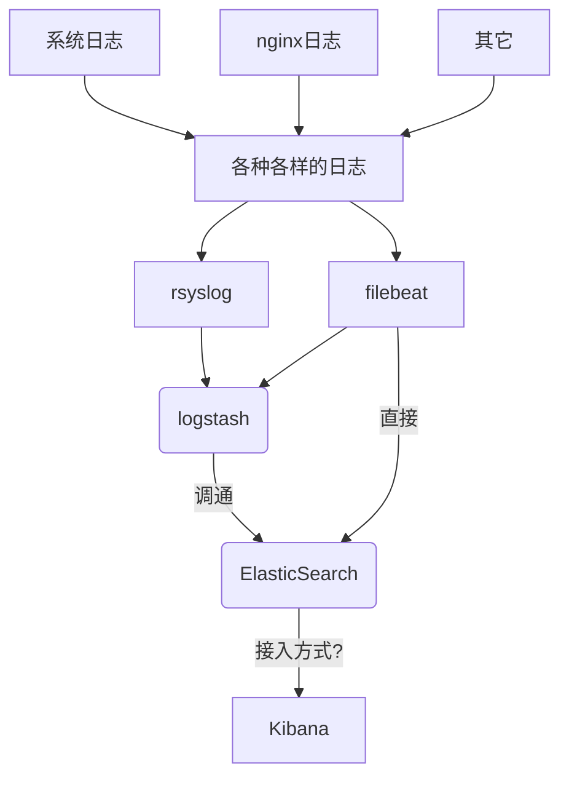

## 日志分析系统

[TOC]

说明：

目的在于日志分析接口模块化，减少初期的重复数据加工，目前有以下几种方案

| 编号   | 方案                                  | 技术点                                 | 备注          |
| ---- | ----------------------------------- | ----------------------------------- | ----------- |
| 1    | 手动解析                                | awk                                 |             |
| 2    | Rsyslog+LogAnayzer+MySQL            | Rsyslog+LogAnayzer+MySQL            |             |
| 3    | Logstash+Elasticsearch+Redis+Kinaba | Logstash+Elasticsearch+Redis+Kinaba |             |
| 4    | goaccess                            | goaccess日志格式解析配置                    | 成熟解决方案，关注配置 |

高级方案流程图：




### 手动解析

#### 基础版

| 脚本编号 | 脚本                | 应用                 | 说明   |
| ---- | ----------------- | ------------------ | ---- |
| 1    | log_stat.awk      | awk实现基础版           |      |
| 2    | log_stat_impl.awk | awk实现增强版，增加了类别的汇总量 |      |
| 3    | log_stat.py       | python实现           |      |
| 4    | log_stat.data     | 测试数据               | 测试数据 |

日志格式是标准的日志格式：

```nginx
$remote_addr - $remote_user [$time_local] "$request" $status $body_bytes_sent "$http_referer" "$http_user_agent"
```

#### 金矿版

awk金矿版实现,日志中都带有$time_local字段，是典型的基于文件的时间序列数据库。

##### 请求访问分析

- 单位时间内的请求数

```

```

##### 流量速率分析

- 网络流量和速率

包含响应时间和页面尺寸等字段，在此基础上计算网络流量和速率,nginx日志中的$body_sent_size指http响应体的大小，如果想看整个响应大小，应该使用\$send_size

```shell
awk '{url=$7;requests[url]++;bytes[url]+=$10}END{for(url in requests){printf("%sMB %sKB/req %s %s\n",bytes[url]/1024/1024,bytes[url]/requests[url]/1024,requests[url],url)}}' |sort -nr|head -n 15
```

##### 慢查询分析

```shell
//待补充
```

### Rsyslog+MySQL+LogAnayzer

说明：

- rsyslog 收集系统日志
- mysql 负责存储收集到日志
- loganayzer 日志可视化

loganayzer负责读取mysql中的日志数据并可视化

#### Rsyslog

syslog是一个快速处理收集系统日志的程序，rsyslog是syslog的升级版，它将多种来源不同设施主机发送的日志过滤合并到一个独立的位置。

##### 安装

```shell
yum install rsyslog rsyslog-mysql
# 其中后者是将日志传送到MySQL数据库的一个模块
```

##### 配置

配置服务器端

```shell
vim /etc/rsyslog.conf

# part1:在 #### MODULES #### 下添加上面两行
$ModLoad ommysql   
*.* :ommysql:localhost,Syslog,rsyslog,123
#说明：localhost 表示本地主机，Syslog 为数据库名，rsyslog 为数据库的用户，123为该用户密码。

# part2: 开启相关日志模块
$ModLoad immark      #immark是模块名，支持日志标记
$ModLoad imudp    	 #imupd是模块名，支持udp协议
$UDPServerRun 514    #允许514端口接收使用UDP和TCP协议转发过来的日志

# part3:重启rsyslog服务
/etc/init.d/rsyslog restart
service rsyslog restart
```

配置客户端

```shell
//将日志输出到服务器端,注意在任何情况下都不要明文传输，而是要用TLS/SSL加密
```

> 更多的[配置](http://blog.csdn.net/zhangdaisylove/article/details/46843233)

#### MySQL

```shell
# 创建mysql的日志库，执行以下命令即可
/usr/share/doc/rsyslog/mysql-createDB.sql 

# 创建mysql的rsyslog用户并授权
grant all on Syslog.* to rsyslog@localhost identified by '123';
flush privileges;
```

> 备注：
>
> 导入数据库操作创建了Syslog 库并在该库中创建了两张空表SystemEvents 和SystemEventsProperties。

#### LogAnalyzer

​	LogAnalyzer 是一款syslog日志和其他网络事件数据的Web前端。它提供了对日志的简单浏览、搜索、基本分析和一些图表报告的功能。数据可以从数据库或一般的 syslog文本文件中获取，所以LogAnalyzer不需要改变现有的记录架构。基于当前的日志数据，它可以处理syslog日志消 息、Windows事件日志记录，支持故障排除，使用户能够快速查找日志数据中看出问题的解决方案。

​	LogAnalyzer 获取客户端日志会有两种保存模式，一种是直接读取客户端/var/log/目录下的日志并保存到服务端该目录下，一种是读取后保存到日志服务器数据库中，推荐使用后者。

> 备注:
>
> LogAnalyzer 采用php开发，所以日志服务器需要php的运行环境，本文采用LAMP
>
> 配置参考`git::/shared_common_libs/Tools/linux/docs`

##### 问题

- 若loganalyzer安装的时候总是提示writeable权限问题，可现在windows本机上配置好，然后上传到linux主机上即可
- 若loganalyzer统计图片显示php编译[缺失FreeType支持](http://bbs.itxdl.cn/read.php?tid-122207.html)时，重新编译php的时候添加`--with-freetype-dir --enable-gd-native-ttf`参数即可

#### 问题和进度

> 2017年4月3日

安装loganalyzer的时候卡在配置文件不可写这一步了

### Logstash+ES+Kibana

组成说明：

- Logstash: logstash server端用来搜集日志；
- Elasticsearch: 存储各类日志；
- Kibana: web化接口用作查寻和可视化日志；
- Logstash Forwarder: logstash client端用来通过lumberjack 网络协议发送日志到logstash server

> logstash和Elasticsearch是用Java写的，kibana使用node.js框架。

原理介绍：

​	logstash是一个数据分析软件，主要目的是分析log日志。整一套软件可以当作一个MVC模型，logstash是controller层，Elasticsearch是一个model层，kibana是view层。

​      首先将数据传给logstash，它将数据进行过滤和格式化（转成JSON格式），然后传给Elasticsearch进行存储、建搜索的索引，kibana提供前端的页面再进行搜索和图表可视化，它是==调用Elasticsearch的接口返回的数据进行可视化==。

框架图：


#### Logstash

日志文件收集、过滤和存储

##### 安装

安装logstash：

```shell
wget -c https://download.elastic.co/logstash/logstash/packages/centos/logstash-2.3.2-1.noarch.rpm
rpm -ivh logstash-2.3.2-1.noarch.rpm
```

安装logstash插件：

安装Logstash input、output插件，此案例数据输入是MySQL，输出是ES，所以相应的插件应该是logstash-input-jdbc和logstash-output-elasticsearch。

```shell
logstash-plugin install logstash-input-jdbc
logstash-plugin install logstash-output-elasticsearch
```

配置

```shell
[root@local122 etc]# rpm -qc logstash
/etc/init.d/logstash  
/etc/logrotate.d/logstash
/etc/sysconfig/logstash  # logstash默认配置文件(指明了配置目录)

# 配置文件目录
cd /etc/logstash/conf.d
```

> 配置文件示例：
>
> ```json
> [root@elk ~]# cat /etc/logstash/conf.d/01-logstash-initial.conf
> input {
>   beats {
>     port => 5000
>     type => "logs"
>     ssl => true
>     ssl_certificate => "/etc/pki/tls/certs/logstash-forwarder.crt"
>     ssl_key => "/etc/pki/tls/private/logstash-forwarder.key"
>   }
> }
>
> filter {
>   if [type] == "syslog-beat" {
>     grok {
>       match => { "message" => "%{SYSLOGTIMESTAMP:syslog_timestamp} %{SYSLOGHOST:syslog_hostname} %{DATA:syslog_program}(?:\[%{POSINT:syslog_pid}\])?: %{GREEDYDATA:syslog_message}" }
>       add_field => [ "received_at", "%{@timestamp}" ]
>       add_field => [ "received_from", "%{host}" ]
>     }
>     geoip {
>       source => "clientip"
>     }
>     syslog_pri {}
>     date {
>       match => [ "syslog_timestamp", "MMM d HH:mm:ss", "MMM dd HH:mm:ss" ]
>     }
>   }
> }
>
> output {
>   elasticsearch { }
>   stdout { codec => rubydebug }
> }
> ```

启动

```shell
service logstash start
# 停止
service logstash stop
# 查看状态
service logstash status
# 重启
service logstash restart

[root@local122 sbin]# service logstash help
Usage:  {start|stop|force-stop|status|reload|restart|configtest}
```

##### 配置

###### 定义数据源

此处演示的是logstash收集mysql的数据然后同步到es上去，即[mysql准实时同步数据到Elasticsearch](https://www.toutiao.com/a6494077866689430030/)

除此之外，logstash可以收集多种多样的日志，参见[logstash通过rsyslog对nginx的日志收集和分析](http://blog.51cto.com/bbotte/1615477)

logstash的数据源支持从文件，stdin,kafka、beats、redis等来源

例子1(mysql源):

```json
input{
    jdbc {
        jdbc_driver_library => "mysql-connector-java-5.1.23-bin.jar"
        jdbc_driver_class => "com.mysql.jdbc.Driver"
        jdbc_connection_string => "jdbc:mysql://localhost:3306/test"
        jdbc_user => "root"
        jdbc_password => "root"
        jdbc_paging_enabled => "true"
        jdbc_page_size => "1000"
        jdbc_default_timezone =>"Asia/Shanghai"
        schedule => "* * * * *"
        statement => "select * from documents where updatetime > :sql_last_value"
        use_column_value => true
        tracking_column => "updatetime"
        last_run_metadata_path => "./logstash_jdbc_last_run"
    }
}

filter{
   //最核心部分
}

output{
    elasticsearch {
        hosts => "localhost:9200"
        user => "elastic"
        password => "es_password"
        index => "employee"
        document_id => "%{id}"
    }
    stdout {
        codec => json_lines
    }
}
```

> 备注：
>
> - mysql-connector-java-5.1.23-bin.jar的[下载](http://www.java2s.com/Code/Jar/m/Downloadmysqlconnectorjava5124binjar.htm)
> - elasticsearch的用户和密码不明确，没有配置

例子2（beats源）：

```json
input {
  beats {
    port => 5044
    type => "logs"
  }
}

filter {
  if [type] == "syslog-beat" {
    grok {
      match => { "message" => "%{SYSLOGTIMESTAMP:syslog_timestamp} %{SYSLOGHOST:syslog_hostname} %{DATA:syslog_program}(?:\[%{POSINT:syslog_pid}\])?: %{GREEDYDATA:syslog_message}" }
      add_field => [ "received_at", "%{@timestamp}" ]
      add_field => [ "received_from", "%{host}" ]
    }
    geoip {
      source => "clientip"
    }
    syslog_pri {}
    date {
      match => [ "syslog_timestamp", "MMM d HH:mm:ss", "MMM dd HH:mm:ss" ]
    }
  }
}

output {
  elasticsearch { 
    hosts => "localhost:9200"
    user => "elastic"
    password => "es_password"
    index => "test1"
  }
  stdout { codec => rubydebug }
}
```

###### 定义日志格式

文件日志格式如下：

```
2015-05-07-16:03:04|10.4.29.158|120.131.74.116|WEB|11299073|http://quxue.renren.com/shareApp?isappinstalled=0&userId=11299073&from=groupmessage|/shareApp|null|Mozilla/5.0 (iPhone; CPU iPhone OS 8_2 like Mac OS X) AppleWebKit/600.1.4 (KHTML, like Gecko) Mobile/12D508 MicroMessenger/6.1.5 NetType/WIFI|duringTime|98||
```

日志解析：

```json
filter {
  #定义数据的格式
  grok { 
  	match => { "message" => "%{DATA:timestamp}\|%{IP:serverIp}\|%{IP:clientIp}\|%{DATA:logSource}\|%{DATA:userId}\|%{DATA:reqUrl}\|%{DATA:reqUri}\|%{DATA:refer}\|%{DATA:device}\|%{DATA:textDuring}\|%{DATA:duringTime:int}\|\|"}
  }

  #定义时间戳的格式
  date {
    match => [ "timestamp", "yyyy-MM-dd-HH:mm:ss" ]
    locale => "cn"
  }

  #定义客户端的IP是哪个字段（上面定义的数据格式）
  geoip {
    source => "clientIp"
  }

  #定义客户端设备是哪一个字段
  useragent {
    source => "device"
    target => "userDevice"
  }

  # 需要进行转换的字段，这里是将访问的时间转成int，再传给Elasticsearch
  mutate {
    convert => ["duringTime", "integer"]
  }
}
```

###### 定义输出配置

```shell
output {
  #将输出保存到elasticsearch，如果没有匹配到时间就不保存，因为日志里的网址参数有些带有换行
  if [timestamp] =~ /^\d{4}-\d{2}-\d{2}/ {
        elasticsearch { host => localhost }
  }

   #输出到stdout
#  stdout { codec => rubydebug }

   #定义访问数据的用户名和密码
#  user => webService
#  password => 1q2w3e4r
}
```

##### 启动

```shell
logstash -f xxx.conf
# 其中xxx.conf上一节的输入源配置、过滤配置和输出配置
```

#### Redis

```shell
# Redis作为数据存储层，【作用暂时不明确】
```

#### Elasticesearch

##### 安装

安装

```shell
wget -c https://download.elastic.co/elasticsearch/release/org/elasticsearch/distribution/rpm/elasticsearch/2.3.3/elasticsearch-2.3.3.rpm
rmp -ivh elasticsearch-2.3.3.rpm
```

启动：

> NOT starting on installation, please execute the following statements to configure elasticsearch service to start automatically using systemd
>
> ```shell
> sudo systemctl daemon-reload
> sudo systemctl enable elasticsearch.service
> ```
>
> You can start elasticsearch service by executing
>
> ```shell
> sudo systemctl start elasticsearch.service
> ```

安装插件

```shell
直接将对应的插件文件放到安装目录下的plugins下即可，注意是插件的_src目录下的文件
```

##### 配置

```shell
vim /etc/elasticsearch/elasticsearch.yml
# 更多的详细配置待补充
```

##### 启动

```shell
service elasticsearch start
[root@local122 sbin]# service elasticsearch help
Usage: /etc/init.d/elasticsearch {start|stop|status|restart|condrestart|try-restart|reload|force-reload}
```

#### Kibana

kibana是node.js写的，依赖于java环境

#####  安装

```shell
wget -c https://download.elastic.co/kibana/kibana/kibana-4.5.1-1.x86_64.rpm
rpm -ivh kibana-4.5.1-1.x86_64.rpm

# 默认安装目录是/opt/kibana/，将该目录下的bin目录添加到环境变量中即可
```

##### 配置

```shell
vim /opt/kibana/config/kibana.yml
# 默认监听端口是5601，可以修改
```

##### 启动

```shell
nohup bin/kibana &
# 或者
service kibana start
[root@local122 config]# service kibana help
# Usage:  {start|force-start|stop|force-start|force-stop|status|restart}
```

> 补充说明：这是因为在安装的时候被注册成服务了，因此可以直接使用servive xxx start等命令对服务进行管理，此外还有elasticsearch、filebeat、jenkins、logstash等

#### 问题和进度

```shell
# 待补充
```

### goaccess

goaccess包含解析和可视化

#### nginx日志格式

```nginx
# nginx的默认日志格式
log_format main '$remote_addr - $remote_user [$time_local] "$request"'
                '$status $body_bytes_sent "$http_referer" '
                '"$http_user_agent" "$http_x_forwarded_for"';
server {
    listen 80 default_server;
    listen [::]:80 default_server;

    # 启用认证访问(这块接触的很少，待研究)
    auth_basic "nginx auth";
    auth_basic_user_file /etc/nginx/auth;
}
```

nginx参数说明：

```nginx
$remote_addr -     # 访问来源ip 后面的"-" 是个普通字符
$remote_user       # 用户，只有在启用 auth_basic 认证访问的时候才会出现，否则是一个 "-" 字符
[$time_local]      # 日期，时间，时区
"$request" 		   # 请记录请求的URL和HTTP协议，这里有双引号
$status # 状态码
$body_bytes_sent   # 包发送大小(是服务器返回给客户端的大小)，不包括响应头
"$http_referer"    # 记录从哪个页面链接访问过来的（引用页），有双引号
"$http_user_agent" # 客户端useragent信息（系统版本、浏览器等），双引号
"$http_x_forwarded_for" # nginx做反向代理时的客户端地址 注意，这里有双引号

# 扩展参数
$bytes_sent 		 # 发送给客户端的总字节数。
$connection 		 # 连接的序列号。
$connection_requests # 当前通过一个连接获得的请求数量。
$request_length 	 # 请求的长度（包括请求行，请求头和请求正文）。
$request_time  		 # 请求处理时间，单位为秒，精度毫秒； 从读入客户端的第一个字节开始，直到把最后一个字符发送给客户端后进行日志写入为止。
```

#### goaccess日志格式

goaccess日志格式说明：

```shell
time-format %H:%M:%S
date-format %d/%b/%Y
log-format %h %^ %^ [%d:%t %^] "%r" %s %b "%R" "%u" %^
翻译成nginx日志格式是
$remote_addr - $remote_user [$time_local] "$request" $status $body_bytes_sent "$http_referer" "$http_user_agent"
10.0.2.2 - - [25/May/2017:15:45:43 +0800] "GET /demo?data=zhang&name=ilovey HTTP/1.1" 500 29465 "-" "Mozilla/5.0 (Windows NT 10.0; Win64; x64) AppleWebKit/537.36 (KHTML, like Gecko) Chrome/
58.0.3029.110 Safari/537.36"
```

> 不要忘记日志格式中的双引号，及其他字符，如[]，否则会解析失败,参数说明：
>
> ```shell
> %x 与时间格式和日期格式变量匹配的日期和时间字段。当使用时间戳而不是日期和时间在两个单独的变量中时使用这个。
>
> %t time字段匹配时间格式变量。
>
> %d date字段匹配日期格式变量。
>
> %v 根据规范名称设置（服务器块或虚拟主机）的服务器名称。
>
> %e 这是通过HTTP身份验证请求文档的用户ID。
>
> %h host（客户端IP地址，IPv4或IPv6）
>
> %r 客户端的请求行。这需要围绕请求的特定分隔符（单引号，双引号等）可解析。否则，请使用特殊格式说明符（如%m，%U，%q和%H）的组合来解析各个字段。
> 注意：使用%r获取完整请求或%m，%U，%q和%H以形成请求，两者不要同时使用。
> %m 请求方式。
> %U 请求的URL路径。
> 注意：如果查询字符串在%U中，则不需要使用%q。但是，如果URL路径不包含任何查询字符串，则可以使用%q，并将查询字符串追加到请求中。
> %q 查询字符串。
> %H 请求协议。
>
> %s 服务器发送回客户端的状态码。
>
> %b 返回给客户端的对象的大小。
>
> %R “Referer”HTTP请求标头。
>
> %u 用户代理HTTP请求标头。
>
> %D 服务请求所用的时间，以微秒为单位。
>
> %T 以毫秒级分辨率提供服务所需的时间（秒）。
>
> %L 服务请求所需的时间，以毫秒为单位，为十进制数。
>
> %^ 忽略此字段。
>
> %~ 向前移动日志字符串，直到找到一个非空格（！isspace）字符。
>
> ~h X-Forwarded-For（XFF）字段中的主机（客户端IP地址，IPv4或IPv6）
> ```

使用:

```shell
goaccess -f /var/log/nginx/access.log  -o ./access.html
# 在生成html时候加一个参数 --real-time-html，这时goaccess会在当前窗口一直运行，可以用nohup放到后台。
```

> 更多的使用可以参考`man goaccess`

### 知识补充

#### filebeat

监控日志文件、转发。

```shell
filebeat客户端是一个轻量级的、从服务器山的文件收集日志资源的工具。这些日志转发到处理logstash的服务器上，该filebeat客户端使用的安全的beats协议与logstash实例通信。
```

filebeat原理


##### 安装

```shell
 wget -c https://download.elastic.co/beats/filebeat/filebeat-1.2.3-x86_64.rpm
 rpm -ivh filebeat-1.2.3-x86_64.rpm
```

##### 配置

```shell
# rpm -qc filebeat
vim /etc/filebeat/filebeat.yml

[root@rsyslog elk]# cd /etc/filebeat/
[root@rsyslog filebeat]# tree
.
├── conf.d
│   ├── authlogs.yml
│   └── syslogs.yml
├── filebeat.template.json
└── filebeat.yml
```

其中filebeat.yml是定义连接logstash服务器的配置。conf.d目录下的连个配置文件是定义监控日志的。

syslog.yml文件内容如下：

```yaml
filebeat:
  prospectors:
    - paths:
      - /var/log/messages
      encoding: plain
      fields_under_root: false
      input_type: log
      ignore_older: 24h
      document_type: syslog-beat
      scan_frequency: 10s
      harvester_buffer_size: 16384
      tail_files: false
      force_close_files: false
      backoff: 1s
      max_backoff: 1s
      backoff_factor: 2
      partial_line_waiting: 5s
      max_bytes: 10485760
```

nginx.yml文件内容如下：

```json
filebeat:
  prospectors:
    - paths:
      - /usr/local/nginx/logs/site_acc.log  # 指定要监控的日志，可以具体的文件或目录
      encoding: plain
      fields_under_root: false
      input_type: log  # 固定值，几乎不可修改
      ignore_older: 24h
      document_type: syslog-beat
      scan_frequency: 10s
      harvester_buffer_size: 16384
      tail_files: false
      force_close_files: false
      backoff: 1s
      max_backoff: 1s
      backoff_factor: 2
      partial_line_waiting: 5s
      max_bytes: 10485760
```

filebeat.yml文件内容如下:

```json
#cat filebeat.yml 
filebeat:
  spool_size: 1024
  idle_timeout: 5s
  registry_file: .filebeat
  config_dir: /etc/filebeat/conf.d
output:
  logstash:
     hosts: ["localhost:5044"]
```

###### [filebeat.yml详解](https://www.cnblogs.com/zlslch/p/6622079.html)

输入配置

```
- filebeat.yml文件定义的每个prospectors都是一个日志源，可以单独的放在conf.d目录中进行管理（此处的`authlogs.yml`和`syslogs.yml`即是两个例子）
- prospectors的公共配置可以放在filebeat.yml文件中
```

输出配置：

```
输出可以是elasticsearch、logstash、file、console

filebeat连接logstath：
```

shipper配置

```
待补充
```

logging配置

```
待补充
```

##### 启动

```shell
service filebeat start
[root@local122 init.d]# service filebeat help
# Usage: /etc/init.d/filebeat {start|stop|status|restart|condrestart}
```

##  参考

- 手动解析

  [如何挖掘Nginx日志中的金矿（推荐）](http://mp.weixin.qq.com/s/t-ktlzJsrpad1-YRuIakiw)

- 基础版

  [ngxtop：在命令行实时监控 Nginx 的神器](http://mp.weixin.qq.com/s/UnIX7UKIjEkKbt7UDxUnxw)

- 升级版

  [Linux日志分析终极指南](http://blog.jobbole.com/110660/)

  [Nginx日志分析及性能排查](http://mp.weixin.qq.com/s/A1ufVgi3VFuSGRh4Ju5puA)

  [Logstash+Elasticsearch+Redis+Kinaba（ELK）日志可视化分析系统](http://467754239.blog.51cto.com/4878013/1700828)

  [Centos6.5利用Rsyslog+LogAnayzer+MySQL部署日志服务器](http://www.mamicode.com/info-detail-1165648.html)(推荐)

  [EFK Nginx日志的可视化分析](http://www.toutiao.com/i6352290798666514945/)

  [Centos7 之安装Logstash ELK stack 日志管理系统（推荐）](http://www.cnblogs.com/hanyifeng/p/5509985.html)

  [logstatsh日志分析的配置和使用](https://www.cnblogs.com/yincheng/p/logstash.html)

  [x-pack插件的安装(推荐)](https://www.elastic.co/downloads/x-pack)

  [logstatsh插件之grok](https://www.elastic.co/guide/en/logstash/current/plugins-filters-grok.html)

  [慕课网:ELK三剑客安装指南](https://www.imooc.com/learn/920)

- goaccess

  [goaccess日志分析详解](http://www.toutiao.com/i6460608551814431245/)

- 知识补充

  [filebeat原理](http://images2015.cnblogs.com/blog/997621/201612/997621-20161227223331070-312389171.png)


